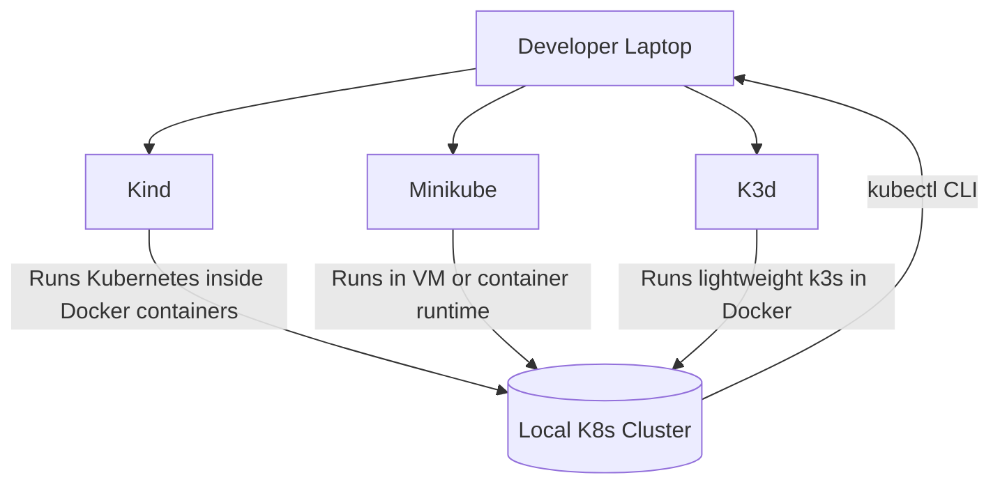

# Kubernetes Local Setup

This guide helps you set up a **local Kubernetes cluster** using one of three tools:

* [Kind](https://kind.sigs.k8s.io/)
* [Minikube](https://minikube.sigs.k8s.io/docs/)
* [K3d](https://k3d.io/)

---

## 🔎 What is Each Tool?

### 🐳 Kind (Kubernetes in Docker)

* Runs Kubernetes clusters inside Docker containers.
* Great for **CI/CD pipelines**, testing, and fast local development.
* Very lightweight, no need for VMs.

### 💻 Minikube

* Runs a **single-node Kubernetes cluster** on your laptop (inside VM or container runtime).
* Easiest option for beginners.
* Supports add-ons (Ingress, Metrics Server, Dashboard).

### ⚡ K3d (Lightweight K3s in Docker)

* Wrapper around [K3s](https://k3s.io/) (a lightweight Kubernetes distribution).
* Runs K3s inside Docker.
* Great for **edge development**, resource-constrained environments, and local dev.

---

## 📦 Install Options

### 1️⃣ Kind (Kubernetes in Docker)

```bash
# Install Kind (Linux/macOS)
curl -Lo ./kind https://kind.sigs.k8s.io/dl/v0.23.0/kind-linux-amd64
chmod +x ./kind
mv ./kind /usr/local/bin/kind

# Create a cluster
kind create cluster --name dev-cluster
```

---

### 2️⃣ Minikube

```bash
# Install Minikube
curl -LO https://storage.googleapis.com/minikube/releases/latest/minikube-linux-amd64
sudo install minikube-linux-amd64 /usr/local/bin/minikube

# Start cluster
minikube start --driver=docker
```

---

### 3️⃣ K3d (Lightweight k3s in Docker)

```bash
# Install K3d
curl -s https://raw.githubusercontent.com/k3d-io/k3d/main/install.sh | bash

# Create a cluster
k3d cluster create dev-cluster --servers 1 --agents 2
```

---

## 🚀 Verify Cluster

```bash
kubectl get nodes
kubectl get pods -A
```

You should see your cluster nodes and system pods running. ✅

---

## 📊 Architecture Diagram



---

## ⚖️ Comparison: Kind vs Minikube vs K3d

| Feature            | Kind 🐳        | Minikube 💻         | K3d ⚡                          |
| ------------------ | -------------- | ------------------- | ------------------------------ |
| Runs in Docker     | ✅ Yes          | Optional            | ✅ Yes                          |
| Uses VM            | ❌ No           | ✅ Yes               | ❌ No                           |
| Lightweight        | ✅ Yes          | ❌ Medium            | ✅ Very                         |
| Speed              | 🚀 Fast        | ⏳ Slower            | 🚀 Fast                        |
| Best for           | CI/CD, testing | Learning, local dev | Edge dev, lightweight clusters |
| Add-ons            | ❌ No           | ✅ Yes               | ❌ Minimal                      |
| Multi-node support | ✅ Yes          | ✅ Yes               | ✅ Yes                          |

---

## 📘 References

* Kind: [https://kind.sigs.k8s.io/](https://kind.sigs.k8s.io/)
* Minikube: [https://minikube.sigs.k8s.io/docs/](https://minikube.sigs.k8s.io/docs/)
* K3d: [https://k3d.io/](https://k3d.io/)


