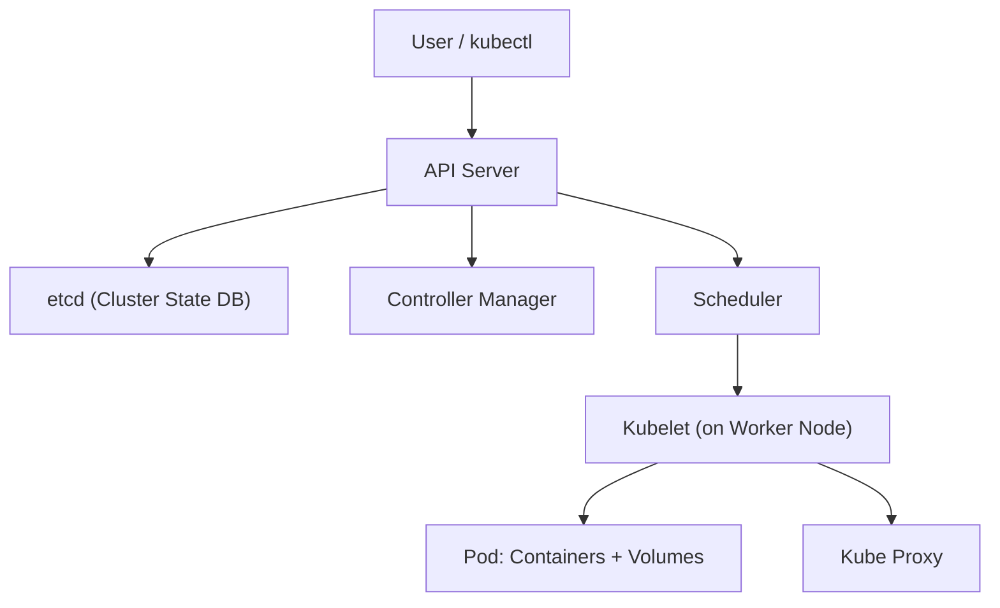
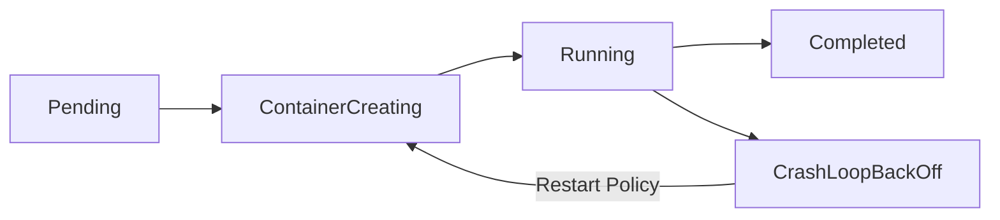

 Deploy First Pod + YAML Anatomy 

## 📌 Introduction

Kubernetes (K8s) is a container orchestration platform that automates deployment, scaling, and management of containerized apps.
The first step in learning Kubernetes is **deploying a Pod** – the smallest deployable unit.

---

## 🔹 Kubernetes Architecture (Block Diagram)



* **API Server** – Entry point for kubectl & REST requests.
* **etcd** – Stores cluster state.
* **Scheduler** – Decides which node runs the Pod.
* **Controller Manager** – Ensures desired state (replicas, deployments).
* **Kubelet** – Agent on each node that manages Pods.
* **Kube Proxy** – Handles networking/routing.

---

## 🔹 Pod Lifecycle Flow



* **Pending** → Pod accepted by API Server, waiting for scheduling.
* **ContainerCreating** → Kubelet pulls image & sets up container.
* **Running** → At least one container is running successfully.
* **Completed** → Pod finished execution (for jobs/batch tasks).
* **CrashLoopBackOff** → Container keeps failing & restarting.

---

## 🔹 Pod Deployment Flow & Logs

When you deploy a Pod:

1. `kubectl apply -f pod.yaml` → request sent to API Server.
2. API Server validates + stores desired state in **etcd**.
3. Scheduler assigns the Pod to a Node.
4. Kubelet pulls container image → starts Pod.
5. Pod lifecycle events are logged:

   * `kubectl get pods` → shows status (`Pending → Running`).
   * `kubectl describe pod <pod-name>` → shows detailed events.
   * `kubectl logs <pod-name>` → shows container logs.

**Example logs (kubectl describe):**

```
Events:
  Type     Reason     Age   From               Message
  ----     ------     ----  ----               -------
  Normal   Scheduled  5s    default-scheduler  Successfully assigned default/nginx-pod to worker-node1
  Normal   Pulling    4s    kubelet            Pulling image "nginx"
  Normal   Pulled     3s    kubelet            Successfully pulled image "nginx"
  Normal   Created    2s    kubelet            Created container nginx
  Normal   Started    1s    kubelet            Started container nginx
```

---

## 🔹 Pod YAML Anatomy

```yaml
apiVersion: v1        # Kubernetes API version
kind: Pod             # Resource type
metadata:             # Data about the Pod
  name: my-first-pod
  labels:
    app: demo
spec:                 # Pod specification
  containers:
    - name: nginx-container
      image: nginx:latest
      ports:
        - containerPort: 80
```

* **apiVersion** → Defines API group.
* **kind** → Resource type (Pod, Deployment, Service).
* **metadata** → Name, labels, namespace info.
* **spec** → Desired state: container(s), image, ports, volumes, etc.

Deploy:

```bash
kubectl apply -f pod.yaml
kubectl get pods
kubectl describe pod my-first-pod
kubectl logs my-first-pod
```

---

## 🔹 Official Docs 📚

* [Kubernetes Pods](https://kubernetes.io/docs/concepts/workloads/pods/)
* [kubectl Cheat Sheet](https://kubernetes.io/docs/reference/kubectl/cheatsheet/)
* [YAML Config Best Practices](https://kubernetes.io/docs/concepts/configuration/overview/)

---

✅ With this, you’ve **deployed your first Pod**, understood the **YAML anatomy**, seen how **logs flow**, and learned the **Pod lifecycle**.

---

Would you like me to also add a **real-world example** (like an `nginx` pod exposed via a Service) in the same README so it feels more practical?
