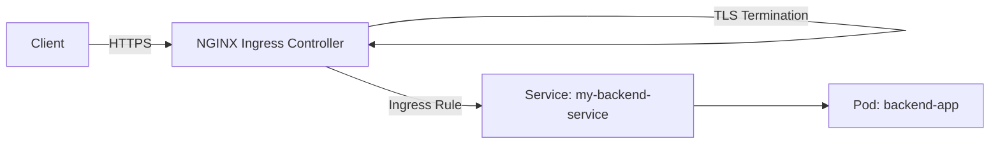
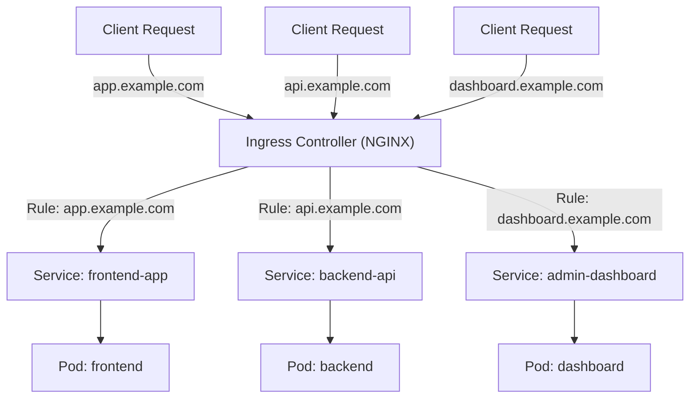

# 🚀 Kubernetes Ingress Controller with NGINX + TLS

This guide explains how to set up an **Ingress Controller** in Kubernetes using **NGINX**, and secure your applications with **TLS (HTTPS)**.

---

## 📘 What is an Ingress?

- **Ingress** is a Kubernetes resource that manages external access to services inside the cluster.  
- It provides:  
  - HTTP/HTTPS routing  
  - Load balancing  
  - SSL/TLS termination  
  - Domain-based routing  

---

## ⚙️ Architecture Overview

1. **Client** → Browser or API client making a request  
2. **Ingress Controller (NGINX)** → Entry point to the cluster  
3. **Ingress Resource** → Defines domain & path-based routing rules  
4. **Service** → Exposes your application Pods internally  
5. **Pods** → Containers running your app  
6. **TLS** → Secures communication via HTTPS  

---

## 📊 Ingress Flow Diagram

```mermaid
flowchart TD
    A[Client Browser] -->|HTTPS Request| B["Ingress Controller (NGINX)"]
    B -->|Ingress Rules| C["Ingress Resource"]
    C -->|Routes traffic| D["Kubernetes Service"]
    D --> E["Application Pods"]

    subgraph TLS
        B -. TLS Termination .-> B
    end
````

---

## 📦 Components

### 1. **Ingress Controller**

* Runs as a Pod/Deployment in your cluster
* NGINX is the most common choice
* Handles all incoming traffic

### 2. **Ingress Resource**

* Defines **rules for domains and paths**
* Example: `api.example.com → backend-service`

### 3. **TLS (HTTPS)**

* Provides secure connection
* Options:

  * **Cert-Manager (Let’s Encrypt)** → Automated
  * **Manual Secret** → Upload `.crt` and `.key` files as a Kubernetes Secret

---

## 🛠️ Setup Steps

### 1. Install NGINX Ingress Controller

```bash
kubectl apply -f https://raw.githubusercontent.com/kubernetes/ingress-nginx/main/deploy/static/provider/cloud/deploy.yaml
```

### 2. Create a TLS Secret (Manual Way)

```bash
kubectl create secret tls example-tls \
  --cert=example.crt \
  --key=example.key \
  -n default
```

### 3. Example Ingress Resource with TLS

```yaml
apiVersion: networking.k8s.io/v1
kind: Ingress
metadata:
  name: example-ingress
  annotations:
    nginx.ingress.kubernetes.io/rewrite-target: /
spec:
  tls:
  - hosts:
      - example.com
    secretName: example-tls
  rules:
  - host: example.com
    http:
      paths:
      - path: /
        pathType: Prefix
        backend:
          service:
            name: my-backend-service
            port:
              number: 80
```

---

## 🔐 Using Cert-Manager (Recommended)

### 1. Install Cert-Manager

```bash
kubectl apply -f https://github.com/cert-manager/cert-manager/releases/download/v1.15.0/cert-manager.yaml
```

### 2. Create an Issuer (Let’s Encrypt Example)

```yaml
apiVersion: cert-manager.io/v1
kind: ClusterIssuer
metadata:
  name: letsencrypt-prod
spec:
  acme:
    server: https://acme-v02.api.letsencrypt.org/directory
    email: your-email@example.com
    privateKeySecretRef:
      name: letsencrypt-prod
    solvers:
    - http01:
        ingress:
          class: nginx
```

### 3. Annotate Ingress for Cert-Manager

```yaml
metadata:
  annotations:
    cert-manager.io/cluster-issuer: letsencrypt-prod
```

---

## 📊 High-Level Architecture Diagram



---

## 🌐 Multi-Service Routing Example



---

## ✅ Benefits

* Centralized entry point for multiple apps
* Domain & path-based routing
* TLS termination for security
* Works with APIs, dashboards, and microservices

---

## 🚀 Conclusion

Using **Kubernetes Ingress + NGINX + TLS** you can:

* Expose multiple services under one domain
* Secure your apps with HTTPS
* Automate certificates with **Cert-Manager**
* Scale applications easily in production

---


Do you want me to also add a **step-by-step request flow diagram** (numbered arrows: `Client → Ingress Controller → Ingress Rule → Service → Pod`), so it’s easier for newcomers?
```
