# 🚀 Kubernetes Ingress Controller with NGINX + TLS

This guide explains how to set up an **Ingress Controller** in Kubernetes using **NGINX**, and secure your applications with **TLS (HTTPS)**.  

---

## 📘 What is an Ingress?
- **Ingress** is a Kubernetes resource that manages external access to services inside the cluster.  
- It provides **HTTP/HTTPS routing**, load balancing, SSL/TLS termination, and domain-based routing.  

---

## ⚙️ Architecture Overview

1. **Client** (Browser / API Client)  
2. **Ingress Controller (NGINX)** → Entry point to the cluster.  
3. **Ingress Resource** → Defines routing rules (`example.com/api → backend-service`).  
4. **Service** → Kubernetes Service that exposes your application Pods.  
5. **Pods** → Actual application containers.  
6. **TLS** → Secures communication via HTTPS.

---

## 📊 Flow Diagram

```mermaid
flowchart TD
    A[🌍 Client Browser] -->|HTTPS Request| B[🔐 Ingress Controller (NGINX)]
    B -->|Ingress Rules| C[📜 Ingress Resource]
    C -->|Routes traffic| D[⚙️ Service]
    D --> E[📦 Application Pods]

    subgraph TLS
        B -. TLS Termination .-> B
    end
````

---

## 📦 Components

### 1. **Ingress Controller**

* Runs as a Pod/Deployment in your cluster.
* NGINX is the most common choice.
* Handles all incoming traffic.

### 2. **Ingress Resource**

* Defines routing rules for domains and paths.
* Example: `api.example.com → backend-service`.

### 3. **TLS (HTTPS)**

* TLS certificate ensures secure connection.
* Can be provisioned using:

  * **Cert-Manager (Let’s Encrypt)** → Automated.
  * **Manual Secret** → Upload `.crt` and `.key` files as Kubernetes Secret.

---

## 🛠️ Setup Steps

### 1. Install NGINX Ingress Controller

```bash
kubectl apply -f https://raw.githubusercontent.com/kubernetes/ingress-nginx/main/deploy/static/provider/cloud/deploy.yaml
```

### 2. Create a TLS Secret (Manual Way)

```bash
kubectl create secret tls example-tls \
  --cert=example.crt \
  --key=example.key \
  -n default
```

### 3. Example Ingress Resource with TLS

```yaml
apiVersion: networking.k8s.io/v1
kind: Ingress
metadata:
  name: example-ingress
  annotations:
    nginx.ingress.kubernetes.io/rewrite-target: /
spec:
  tls:
  - hosts:
      - example.com
    secretName: example-tls
  rules:
  - host: example.com
    http:
      paths:
      - path: /
        pathType: Prefix
        backend:
          service:
            name: my-backend-service
            port:
              number: 80
```

---

## 🔐 Using Cert-Manager (Recommended)

1. Install Cert-Manager:

```bash
kubectl apply -f https://github.com/cert-manager/cert-manager/releases/download/v1.15.0/cert-manager.yaml
```

2. Create an Issuer (Let’s Encrypt Example):

```yaml
apiVersion: cert-manager.io/v1
kind: ClusterIssuer
metadata:
  name: letsencrypt-prod
spec:
  acme:
    server: https://acme-v02.api.letsencrypt.org/directory
    email: your-email@example.com
    privateKeySecretRef:
      name: letsencrypt-prod
    solvers:
    - http01:
        ingress:
          class: nginx
```

3. Annotate Ingress for Cert-Manager:

```yaml
metadata:
  annotations:
    cert-manager.io/cluster-issuer: letsencrypt-prod
```

---

## 📊 High-Level Architecture Diagram

```mermaid
graph LR
    A[🌍 Client] -->|HTTPS| B[NGINX Ingress Controller]
    B -->|TLS Termination| B
    B -->|Ingress Rule| C[Service: my-backend-service]
    C --> D[Pod: backend-app]
```



---

## ✅ Benefits

* Centralized entry point for multiple apps.
* Domain & path-based routing.
* TLS termination for security.
* Works with multiple backends (APIs, dashboards, microservices).

---

## 🚀 Conclusion

Using **Kubernetes Ingress + NGINX + TLS** allows you to:

* Expose multiple services under one domain.
* Secure your apps with HTTPS.
* Automate certificates with **Cert-Manager**.
* Scale applications easily in production.

---

```

---

```
