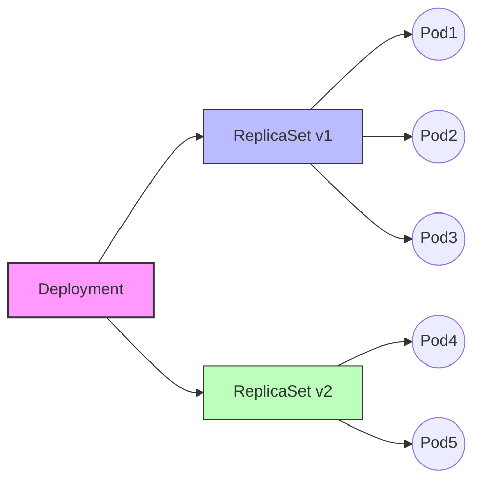

# 🚀 Kubernetes: Deployments, Rollouts & Rollbacks

Kubernetes **Deployment** is a higher-level object that manages ReplicaSets and Pods.  
It allows you to **roll out new versions** of an application and **roll back** if something goes wrong.

---

## 📦 Deployment
- Declarative way to manage Pods & ReplicaSets.
- Ensures desired state (number of replicas, container version).

```yaml
apiVersion: apps/v1
kind: Deployment
metadata:
  name: my-app
spec:
  replicas: 3
  selector:
    matchLabels:
      app: my-app
  template:
    metadata:
      labels:
        app: my-app
    spec:
      containers:
      - name: app
        image: my-app:v1
````

---

## 🔄 Rollout

* Updating Deployment = **new ReplicaSet** created.
* Old Pods are replaced gradually.
* Command:

  ```bash
  kubectl rollout status deployment my-app
  ```

---

## ⏪ Rollback

* If rollout fails, revert to the previous version:

  ```bash
  kubectl rollout undo deployment my-app
  ```

---

## 📊 Flow Diagram




```
