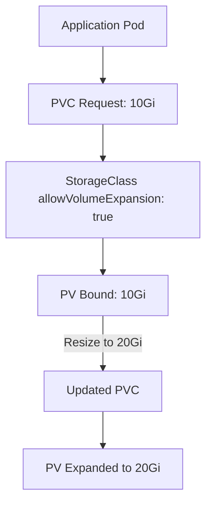

# 📖 Kubernetes: PVC Resize & Retain Policies

Persistent Volumes (PV) and Persistent Volume Claims (PVC) are the backbone of Kubernetes storage. Two important aspects of storage management are:

1. **PVC Resize** – Expanding the size of a PVC when workloads need more storage.
2. **Retention Policies** – Controlling what happens to the underlying PV when the PVC is deleted.

---

## ⚡ PVC Resize in Kubernetes

* PVC resizing is supported for **volume types that allow expansion** (e.g., AWS EBS, GCE Persistent Disk, Azure Disk, CSI drivers like Longhorn, NFS with expansion support).
* Resizing can only **increase size** (shrinking is not supported).
* PVC resize requires:

  * StorageClass with `allowVolumeExpansion: true`
  * CSI Driver support

### Example: StorageClass with Resize Enabled

```yaml
apiVersion: storage.k8s.io/v1
kind: StorageClass
metadata:
  name: expandable-sc
provisioner: ebs.csi.aws.com   # or longhorn.csi.io, nfs.csi.k8s.io, etc.
allowVolumeExpansion: true
reclaimPolicy: Retain
```

### Example: PVC Resize

```yaml
apiVersion: v1
kind: PersistentVolumeClaim
metadata:
  name: my-data-pvc
spec:
  accessModes:
    - ReadWriteOnce
  resources:
    requests:
      storage: 10Gi
  storageClassName: expandable-sc
```

📌 To resize:

```sh
kubectl patch pvc my-data-pvc -p '{"spec": {"resources": {"requests": {"storage": "20Gi"}}}}'
```

---

## 🔄 Retain Policies

When a **PVC is deleted**, the **PV** can behave differently depending on the **Reclaim Policy**:

* **Retain** – PV is not deleted. Admin must manually reclaim it (cleanup + reuse).
* **Delete** – PV and underlying storage are deleted automatically.
* **Recycle** (deprecated) – PV is scrubbed (`rm -rf /thevolume/*`) and reused.

### Example: Retain Policy

```yaml
apiVersion: v1
kind: PersistentVolume
metadata:
  name: my-retained-pv
spec:
  capacity:
    storage: 5Gi
  accessModes:
    - ReadWriteOnce
  persistentVolumeReclaimPolicy: Retain
  csi:
    driver: ebs.csi.aws.com
    volumeHandle: vol-123456
```

---

## 📊 Diagrams

### 1. PVC Resize Flow



---

### 2. Retain vs Delete Policy

```mermaid
flowchart TD
    A[User Deletes PVC] --> B[Check PV Reclaim Policy]

    B -->|Retain| C[PV Stays Bound, Needs Manual Reclaim]
    B -->|Delete| D[PV + Underlying Storage Deleted]
    B -->|Recycle (Deprecated)| E[PV Data Wiped & Reused]
```

---

## 🔗 Useful Links

* [Kubernetes Docs – Expanding Persistent Volumes](https://kubernetes.io/docs/concepts/storage/persistent-volumes/#expanding-persistent-volumes-claims)
* [Kubernetes Docs – Reclaiming Persistent Volumes](https://kubernetes.io/docs/concepts/storage/persistent-volumes/#reclaiming)
* [CSI Drivers on Kubernetes](https://kubernetes-csi.github.io/docs/drivers.html)

---

## 💡 Key Takeaways

* Always check if your **CSI driver supports resizing**.
* Use `allowVolumeExpansion: true` in StorageClass for resizable PVCs.
* Choose reclaim policies wisely:

  * **Retain** = safe for data recovery
  * **Delete** = auto-cleanup for ephemeral workloads

---

