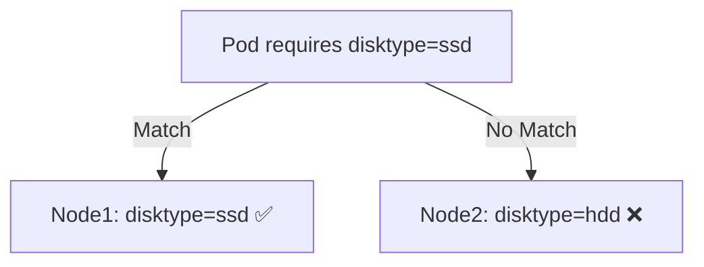
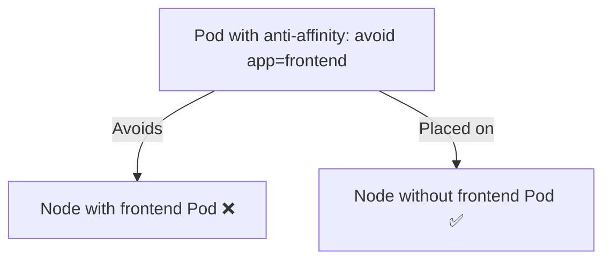

# 🌀 Kubernetes Scheduling: Taints, Tolerations & Affinity

Kubernetes provides powerful mechanisms to control **where Pods run** in a cluster.
Three key features are used for scheduling control:

* **Taints** – repel Pods from Nodes
* **Tolerations** – allow Pods to overcome taints
* **Affinity / Anti-Affinity** – attract Pods to specific Nodes (or keep them apart)

---

## 📌 1. Taints

A **taint** is applied to a Node to **repel Pods** that do not tolerate it.
Think of it as a **rule that says "Don’t schedule here unless allowed."**

```bash
kubectl taint nodes node1 key=value:NoSchedule
```

* **Key:** `key`
* **Value:** `value`
* **Effect:** `NoSchedule`

### Taint Effects

* `NoSchedule` → New Pods won’t schedule here unless tolerated
* `PreferNoSchedule` → Try to avoid, but not strict
* `NoExecute` → Evicts existing Pods & blocks new scheduling

---

## 📌 2. Tolerations

A **toleration** is added to a Pod spec to allow it to run on tainted Nodes.

```yaml
apiVersion: v1
kind: Pod
metadata:
  name: tolerant-pod
spec:
  tolerations:
  - key: "key"
    operator: "Equal"
    value: "value"
    effect: "NoSchedule"
  containers:
  - name: nginx
    image: nginx
```

This Pod **tolerates** the taint `key=value:NoSchedule` and can run on that Node.

---

## 📌 3. Affinity & Anti-Affinity

Affinity rules define **"where Pods prefer (or must) run"**.
They use **Node labels** or **Pod labels** for matching.

---

### 🔹 Node Affinity

Runs Pods only on Nodes matching labels.

```yaml
spec:
  affinity:
    nodeAffinity:
      requiredDuringSchedulingIgnoredDuringExecution:
        nodeSelectorTerms:
        - matchExpressions:
          - key: disktype
            operator: In
            values:
            - ssd
```

➡ Pod runs only on Nodes labeled `disktype=ssd`.

---

### 🔹 Pod Affinity

Attracts Pods to Nodes where other Pods are running.

```yaml
spec:
  affinity:
    podAffinity:
      requiredDuringSchedulingIgnoredDuringExecution:
      - labelSelector:
          matchExpressions:
          - key: app
            operator: In
            values:
            - frontend
        topologyKey: "kubernetes.io/hostname"
```

➡ Pod runs **on the same Node as Pods labeled `app=frontend`**.

---

### 🔹 Pod Anti-Affinity

Prevents Pods from running **on the same Node** as other Pods.

```yaml
spec:
  affinity:
    podAntiAffinity:
      requiredDuringSchedulingIgnoredDuringExecution:
      - labelSelector:
          matchExpressions:
          - key: app
            operator: In
            values:
            - frontend
        topologyKey: "kubernetes.io/hostname"
```

➡ Pod runs **on a different Node** from Pods labeled `app=frontend`.

---

## 🖼️ Flow Diagrams

### 🔹 Taints & Tolerations

```mermaid
flowchart TD
    A[Node with taint: key=value:NoSchedule] -->|Pod-A (No toleration)| B[❌ Cannot Schedule]
    A -->|Pod-B (Has toleration)| C[✅ Schedules Successfully]
```

---

### 🔹 Node Affinity



---

### 🔹 Pod Affinity

```mermaid
flowchart TD
    A[Pod with affinity: wants app=frontend] -->|Placed with| B[Pod (label: app=frontend)]
```

---

### 🔹 Pod Anti-Affinity



---

## 🔗 Useful Links

* 📘 [Kubernetes Docs – Taints and Tolerations](https://kubernetes.io/docs/concepts/scheduling-eviction/taint-and-toleration/)
* 📘 [Kubernetes Docs – Affinity and Anti-Affinity](https://kubernetes.io/docs/concepts/scheduling-eviction/assign-pod-node/)
* 📘 [Kubernetes Docs – Node Affinity](https://kubernetes.io/docs/concepts/scheduling-eviction/assign-pod-node/#node-affinity)

---

## ✅ Summary

* **Taints**: Repel Pods from Nodes
* **Tolerations**: Let Pods tolerate taints
* **Affinity**: Attract Pods to Nodes (or Pods)
* **Anti-Affinity**: Keep Pods apart

Together, they provide **fine-grained scheduling control** in Kubernetes.

---

👉 This README is **GitHub-ready** with **Mermaid flow diagrams**.

Do you want me to also add a **real-world use case section** (e.g., “dedicated GPU nodes for ML workloads”, “high availability web servers spread across nodes”)? That would make this README even stronger.
