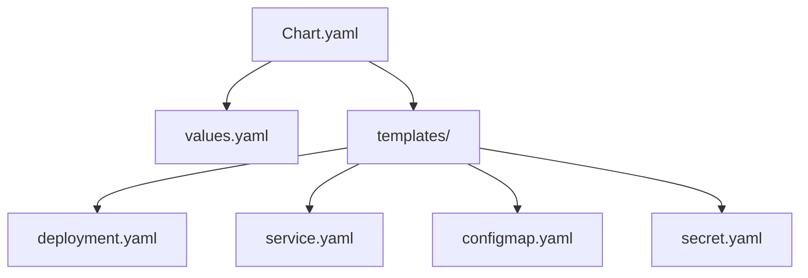
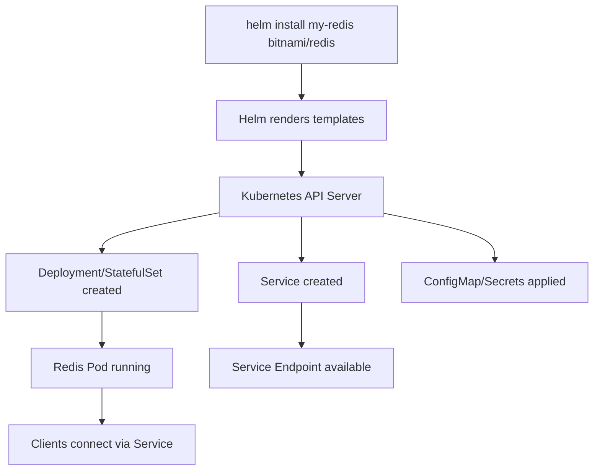
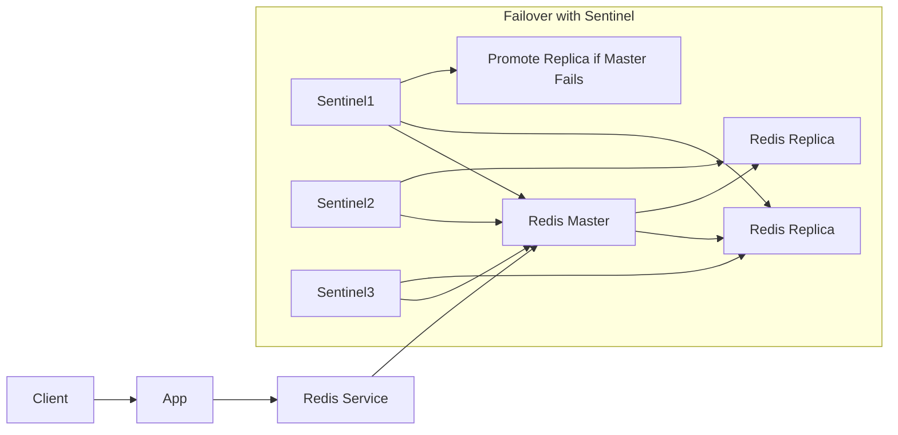

## What are Helm Charts?

Helm is a Kubernetes package manager that simplifies deployment, management, and versioning of Kubernetes applications using pre-configured packages called "charts." Charts are collections of YAML files that define a set of Kubernetes resources and customizable templates, making complex applications repeatable and easy to upgrade.

A typical **Helm Chart** consists of:

* `Chart.yaml`: Chart metadata (name, version, description)
* `values.yaml`: User-customizable configuration values
* `templates/`: Directory holding template files for Kubernetes manifests.

### Visual: Helm Chart Structure



---

## What is Redis?

**Redis** is an in-memory, key-value data store commonly used for caching, session management, real-time analytics, pub/sub systems, and as a NoSQL database. It's valued for its speed and versatility, supporting complex data types (strings, hashes, lists, sets) and persistence options.

* **Main Use Cases**: Caching, message brokering, leaderboard/ranking, streaming analytics.
* **Architecture**: Single-instance, master-replica (primary/secondary), or sharded/clustered modes.

---

## Why Use Helm for Redis on Kubernetes?

Deploying Redis natively on Kubernetes requires manually authoring and maintaining multiple YAML files (Deployment, Service, ConfigMap, etc.). Helm automates this process, providing production-tested charts maintained by community or vendors (like Bitnami), enabling:

* Quick installations and upgrades
* Parameterized deployments (scaling, authentication, persistence, etc.)
* Consistent best-practices configuration.

---

## How to Deploy Redis using Helm

### 1. Prerequisites

* Kubernetes cluster (any cloud or local, e.g., Minikube, kind, EKS, GKE, AKS)
* `kubectl` configured and access to the cluster
* Helm CLI installed ([https://helm.sh/docs/intro/install/](https://helm.sh/docs/intro/install/))

### 2. Add Redis Helm Chart Repository

```sh
helm repo add bitnami https://charts.bitnami.com/bitnami
helm repo update
```

### 3. Install Redis with Helm

Default single-node Redis:

```sh
helm install my-redis bitnami/redis
```

Install Redis Cluster (for production/high availability):

```sh
helm install my-redis-cluster bitnami/redis --set architecture=replication
```

* Customize settings using `--set` flags or by editing a separate values file.

### 4. Verify Installation

```sh
kubectl get pods
kubectl get svc
```

### 5. Access Redis

By default, Redis runs as a Kubernetes service. To connect:

```sh
kubectl run -it --rm redis-client --image=bitnami/redis -- bash
redis-cli -h my-redis-master
```

---

## Flowchart: Deploying Redis with Helm



---

## Redis Architecture Flow



---

## Advanced: Customizing Your Redis Helm Deployment

You can tailor deployments by overriding values (e.g., password, persistence, resources, replicas):

```sh
helm show values bitnami/redis > my-values.yaml
# Edit my-values.yaml as needed
helm install my-redis bitnami/redis -f my-values.yaml
```

* Set high availability: `architecture=replication`
* Enable password: `auth.enabled=true`
* Persistent storage: `persistence.enabled=true`
* Resource limits, node selectors, and more.

---

## Useful Links

* [Helm Official Documentation](https://helm.sh/docs/)
* [Bitnami Redis Helm Chart](https://artifacthub.io/packages/helm/bitnami/redis)
* [Redis Kubernetes Docs](https://redis.io/docs/latest/operate/kubernetes/deployment/)
* [Deep Dive: Helm in Kubernetes](https://www.logicmonitor.com/blog/what-is-helm-in-kubernetes)
* [Redis Official Site](https://redis.io/about/)

---

## Summary

* **Helm charts** are reusable Kubernetes application templates, simplifying deployments and upgrades.
* **Redis** is a fast in-memory database ideal for caching and analytics.
* Deploying Redis via Helm on Kubernetes is production-ready, scalable, and maintainable.

---

*End of README*
