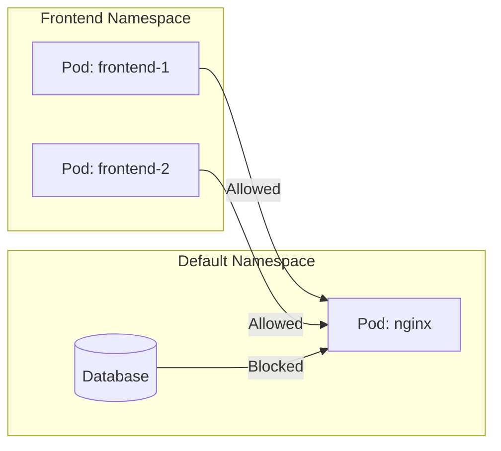

# 📘 Kubernetes Network Policies

Kubernetes **Network Policies** are used to **control traffic flow** between Pods, Namespaces, and external endpoints.
They act as a firewall inside the Kubernetes cluster.

---

## 🔹 What are Network Policies?

* By default, **all pods can communicate with each other** in a Kubernetes cluster.
* NetworkPolicies let you define **who can talk to whom** (ingress and egress rules).
* They are enforced by the **CNI plugin** (Calico, Cilium, Weave, etc.).

---

## ⚙️ Example: Deny All, Allow Specific

```yaml
apiVersion: networking.k8s.io/v1
kind: NetworkPolicy
metadata:
  name: allow-nginx-from-frontend
  namespace: default
spec:
  podSelector:
    matchLabels:
      app: nginx
  ingress:
  - from:
    - podSelector:
        matchLabels:
          role: frontend
```

### Explanation

* Selects Pods with label `app: nginx`.
* Allows traffic **only from Pods with label `role: frontend`**.
* All other traffic is denied.

---

## 🔄 Flowchart: How Network Policies Work


---

## 🌐 Traffic Visualization



---

## 📊 Types of Rules

| Rule Type | Direction                | Example                             |
| --------- | ------------------------ | ----------------------------------- |
| Ingress   | Incoming traffic         | Allow only from frontend pods       |
| Egress    | Outgoing traffic         | Allow DB pod to access external API |
| Both      | Combine ingress + egress | Full control                        |

---

## 📚 Useful Links

* [Kubernetes Docs: Network Policies](https://kubernetes.io/docs/concepts/services-networking/network-policies/)
* [Calico Network Policies](https://docs.tigera.io/calico/latest/network-policy)
* [Cilium Network Policies](https://docs.cilium.io/en/stable/policy/)
* [K8s Policy Recipes](https://github.com/ahmetb/kubernetes-network-policy-recipes)


