# 🛠 Kubernetes PodDisruptionBudget & Pod Priority

This project demonstrates how to **manage pod availability** during disruptions and control **pod scheduling priorities** in a Kubernetes cluster using:

* **PodDisruptionBudget (PDB)** – Ensures a minimum number of pods remain available during voluntary disruptions (e.g., node drain, upgrades).
* **Pod Priority & Preemption** – Assigns priority to pods so important workloads are scheduled first and can preempt lower-priority pods if resources are scarce.

---

## 📌 Concepts

### 1️⃣ PodDisruptionBudget (PDB)

* Guarantees **minimum availability** of pods during voluntary disruptions.
* Key fields:

  * `minAvailable`: Minimum number or percentage of pods that must be up.
  * `maxUnavailable`: Maximum number or percentage of pods that can be down.

Example:

```yaml
apiVersion: policy/v1
kind: PodDisruptionBudget
metadata:
  name: myapp-pdb
spec:
  minAvailable: 2
  selector:
    matchLabels:
      app: myapp
```

---

### 2️⃣ Pod Priority

* Pods can be assigned a **priorityClassName** to indicate their importance.
* **Higher-priority pods** are scheduled first and may **preempt lower-priority pods** if resources are limited.

Example:

```yaml
apiVersion: scheduling.k8s.io/v1
kind: PriorityClass
metadata:
  name: high-priority
value: 1000
globalDefault: false
description: "This priority is for critical workloads"
```

Pod using priority:

```yaml
apiVersion: v1
kind: Pod
metadata:
  name: important-pod
spec:
  priorityClassName: high-priority
  containers:
  - name: app
    image: nginx
```

---

## 📂 Example Project Structure

```
k8s-pdb-priority/
│── deployment.yaml       # Sample deployment with labels
│── pdb.yaml              # PodDisruptionBudget manifest
│── priorityclass.yaml    # PriorityClass manifest
│── README.md             # Documentation
```

---

## 📊 Example Flow Diagram

```mermaid
flowchart TD
A[👷 User triggers node drain] --> B{Check PodDisruptionBudget}
B -->|Pods >= minAvailable| C[✅ Allow disruption]
B -->|Pods < minAvailable| D[⛔ Block disruption]

E[🟢 New Pod Scheduled] --> F{Check Pod Priority}
F -->|High priority & resources available| G[✅ Pod scheduled immediately]
F -->|Low priority & resources scarce| H[⚠️ Pod may be preempted]
```



---

### 📈 How it Works Together

1. **Deployment** defines multiple pods with labels.
2. **PDB** ensures a minimum number of pods remain running during maintenance or voluntary disruption.
3. **PriorityClass** ensures critical pods are scheduled first and can preempt less important pods.
4. Cluster remains **highly available** and **critical workloads are protected**.

---

## 🔧 Apply Manifests

```bash
kubectl apply -f priorityclass.yaml
kubectl apply -f deployment.yaml
kubectl apply -f pdb.yaml
```

Check PDB status:

```bash
kubectl get pdb
kubectl describe pdb myapp-pdb
```

Check pod priority:

```bash
kubectl get pods -o=custom-columns=NAME:.metadata.name,PRIORITY:.spec.priority
```

---

## ⚠️ Best Practices

* Use **PDBs** for highly available workloads (e.g., frontend, API).
* Assign **priority classes** for critical pods like database, caching, or monitoring.
* Avoid overusing **preemption**, as it can disrupt less-critical workloads.
* Combine **HPA (Horizontal Pod Autoscaler)** with PDBs for dynamic scaling and availability.

---

## 📖 References

* [Kubernetes PodDisruptionBudget](https://kubernetes.io/docs/tasks/run-application/configure-pdb/)
* [Kubernetes Pod Priority & Preemption](https://kubernetes.io/docs/concepts/scheduling-eviction/pod-priority-preemption/)


