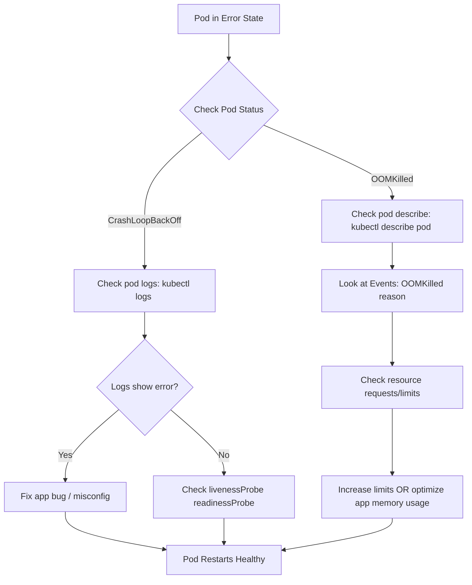

# 🚑 Debugging Kubernetes Pod Failures: CrashLoopBackOff & OOMKilled

This guide provides a structured approach to troubleshoot two of the most common Kubernetes pod issues:

* **CrashLoopBackOff** – Pod keeps restarting due to application crash.
* **OOMKilled** – Pod terminated because it exceeded memory limits.

---

## 📌 Flow Diagram



---

## 🔎 Debugging Steps

### 1. CrashLoopBackOff

**Symptoms**: Pod repeatedly crashes and restarts.

* Check logs of the failed container:

  ```bash
  kubectl logs <pod-name> -n <namespace> --previous
  ```
* Verify probes:

  ```bash
  kubectl describe pod <pod-name>
  ```
* Common causes:

  * Misconfigured env vars
  * Application bug / missing dependency
  * Wrong command/entrypoint
  * Failing liveness/readiness probes

**Fixes**:

* Correct configuration.
* Fix code-level bug.
* Adjust probe thresholds (`failureThreshold`, `initialDelaySeconds`).

---

### 2. OOMKilled

**Symptoms**: Pod terminated due to **Out Of Memory (OOM)**.

* Check pod description for `OOMKilled`:

  ```bash
  kubectl describe pod <pod-name>
  ```
* Review container memory usage:

  ```bash
  kubectl top pod <pod-name>
  ```

**Common causes**:

* Memory limits too low.
* Application memory leak.
* Sudden traffic spikes.

**Fixes**:

* Increase memory limits in Deployment/Pod spec:

  ```yaml
  resources:
    requests:
      memory: "512Mi"
    limits:
      memory: "1Gi"
  ```
* Optimize application memory usage.
* Scale pods horizontally.

---

## 📚 Useful Links

* 🔗 [Kubernetes Docs: Debugging Pods](https://kubernetes.io/docs/tasks/debug/debug-pod-replication-controller/)
* 🔗 [Kubernetes Docs: Pod Lifecycle & Restart Policy](https://kubernetes.io/docs/concepts/workloads/pods/pod-lifecycle/)
* 🔗 [Kubernetes Troubleshooting CrashLoopBackOff](https://kubernetes.io/docs/tasks/debug/debug-application/crash-loop-backoff/)
* 🔗 [OOMKilled Explained – Official Docs](https://kubernetes.io/docs/concepts/configuration/manage-resources-containers/#resource-termination)

