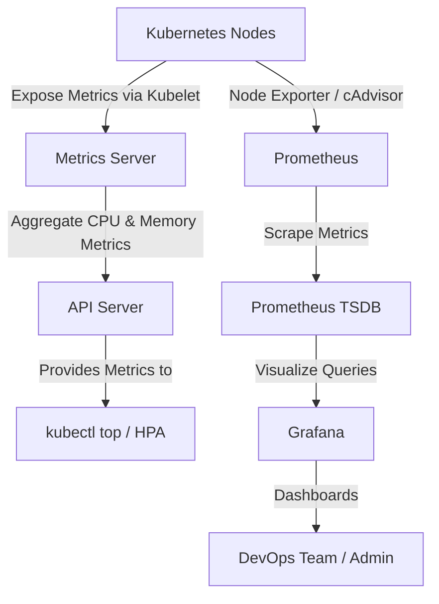
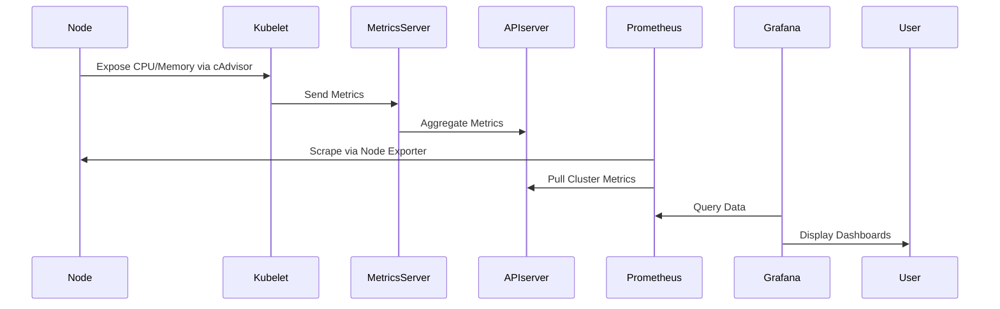
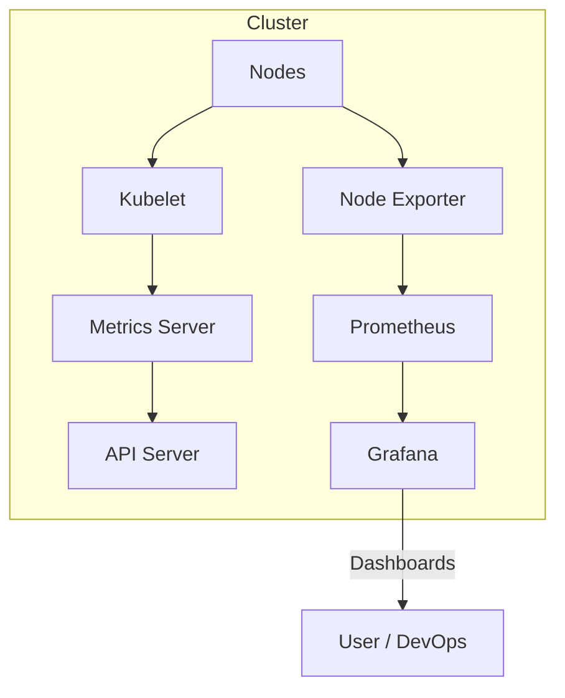

# 📊 Kubernetes Metrics Server + Prometheus + Grafana Setup

## 🚀 Overview

This guide helps you **set up Kubernetes resource monitoring** using:

* **Metrics Server** → lightweight resource metrics aggregator
* **Prometheus** → time-series data collection and alerting
* **Grafana** → visualization dashboard for cluster performance

Together, they form a powerful monitoring stack.

---

## 🧩 Architecture Flow



---

## 🧠 Components Explained

| Component              | Description                                                                       | Default Namespace | Purpose                                                                 |
| ---------------------- | --------------------------------------------------------------------------------- | ----------------- | ----------------------------------------------------------------------- |
| **Metrics Server**     | Collects CPU & memory usage data from nodes and pods via Kubelet API.             | `kube-system`     | Provides metrics for `kubectl top` and Horizontal Pod Autoscaler (HPA). |
| **Prometheus**         | Scrapes and stores metrics (time-series data) from nodes, pods, and applications. | `monitoring`      | Deep metrics collection and alert management.                           |
| **Grafana**            | Visualizes metrics from Prometheus using dashboards.                              | `monitoring`      | UI for system performance and custom alerts.                            |
| **Kubelet / cAdvisor** | Expose container-level metrics (CPU, memory, filesystem, network).                | node-level        | Metric data source for Prometheus.                                      |

---

## ⚙️ Step-by-Step Setup

### 1️⃣ Deploy Metrics Server

```bash
kubectl apply -f https://github.com/kubernetes-sigs/metrics-server/releases/latest/download/components.yaml
```

> ⚠️ If using Minikube or custom clusters, add flags:

```yaml
- --kubelet-insecure-tls
- --kubelet-preferred-address-types=InternalIP,ExternalIP,Hostname
```

Then patch the deployment:

```bash
kubectl edit deployment metrics-server -n kube-system
```

Validate:

```bash
kubectl get deployment metrics-server -n kube-system
kubectl top nodes
kubectl top pods -A
```

---

### 2️⃣ Deploy Prometheus

Use the **Prometheus Community Helm Chart** (recommended):

```bash
helm repo add prometheus-community https://prometheus-community.github.io/helm-charts
helm repo update
helm install prometheus prometheus-community/prometheus --namespace monitoring --create-namespace
```

Check status:

```bash
kubectl get pods -n monitoring
kubectl port-forward svc/prometheus-server 9090:80 -n monitoring
```

Then open → [http://localhost:9090](http://localhost:9090)

---

### 3️⃣ Deploy Grafana

```bash
helm install grafana grafana/grafana --namespace monitoring
kubectl get pods -n monitoring
kubectl port-forward svc/grafana 3000:80 -n monitoring
```

* Default user: `admin`
* Password:

  ```bash
  kubectl get secret grafana -n monitoring -o jsonpath="{.data.admin-password}" | base64 --decode ; echo
  ```

Add **Prometheus** as a data source in Grafana:

* URL: `http://prometheus-server.monitoring.svc.cluster.local`

Import dashboards:

* Kubernetes Cluster Monitoring (ID: `315`)
* Node Exporter Full (ID: `1860`)

---

## 🔁 Prometheus + Grafana + Metrics Server Flow



---

## 🧮 Metrics Collected

| Metric Source      | Example Metrics                                                   | Description           |
| ------------------ | ----------------------------------------------------------------- | --------------------- |
| Metrics Server     | `node_cpu_usage_seconds_total`, `container_memory_usage_bytes`    | Live CPU/memory stats |
| Prometheus         | `kube_pod_status_phase`, `kube_node_status_condition`             | Cluster state         |
| Node Exporter      | `node_filesystem_free_bytes`, `node_network_transmit_bytes_total` | Node health           |
| Grafana Dashboards | CPU load, memory usage, disk IO, network throughput               | Visual overview       |

---

## 📎 Official Links

| Tool               | Official Docs                                                                                                                                                      | GitHub Repo                                                                                                |
| ------------------ | ------------------------------------------------------------------------------------------------------------------------------------------------------------------ | ---------------------------------------------------------------------------------------------------------- |
| **Metrics Server** | [https://kubernetes.io/docs/tasks/debug/debug-cluster/resource-metrics-pipeline/](https://kubernetes.io/docs/tasks/debug/debug-cluster/resource-metrics-pipeline/) | [https://github.com/kubernetes-sigs/metrics-server](https://github.com/kubernetes-sigs/metrics-server)     |
| **Prometheus**     | [https://prometheus.io/docs/introduction/overview/](https://prometheus.io/docs/introduction/overview/)                                                             | [https://github.com/prometheus/prometheus](https://github.com/prometheus/prometheus)                       |
| **Grafana**        | [https://grafana.com/docs/](https://grafana.com/docs/)                                                                                                             | [https://github.com/grafana/grafana](https://github.com/grafana/grafana)                                   |
| **Helm Charts**    | [https://artifacthub.io/packages/helm/prometheus-community/prometheus](https://artifacthub.io/packages/helm/prometheus-community/prometheus)                       | [https://github.com/prometheus-community/helm-charts](https://github.com/prometheus-community/helm-charts) |

---

## 🧰 Troubleshooting

| Issue                             | Fix                                                       |
| --------------------------------- | --------------------------------------------------------- |
| `metrics-server` shows no metrics | Add `--kubelet-insecure-tls` and correct address types.   |
| Grafana shows “No data”           | Check Prometheus target health (`/targets` endpoint).     |
| Prometheus data missing           | Ensure Node Exporter is deployed or configured correctly. |

---

## ✅ Verification Commands

```bash
kubectl top nodes
kubectl top pods -A
kubectl get --raw "/apis/metrics.k8s.io/v1beta1/nodes" | jq .
kubectl get svc -n monitoring
```

---

## 🧠 Summary Diagram



---

## 💡 Summary

* **Metrics Server** → Real-time CPU/memory metrics for pods and nodes.
* **Prometheus** → Scrapes and stores cluster metrics.
* **Grafana** → Turns metrics into visual insights.
* **Together** → Enable intelligent scaling, alerting, and monitoring in Kubernetes.

---

