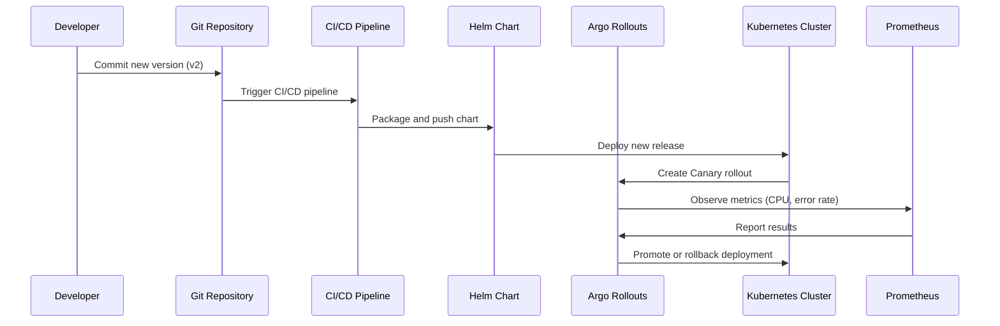
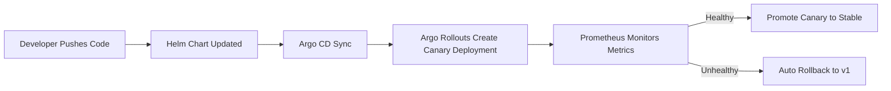

#  Canary Deployment via Argo Rollouts (with Helm Integration)**

---

## 🧠 **Overview**

Modern cloud applications demand **zero-downtime**, **safe**, and **automated deployments**.
Instead of deploying a new version to all users immediately, we can deploy **gradually**, observe its performance, and **automatically rollback** if anything goes wrong — this is **Canary Deployment**.

**Argo Rollouts**, a Kubernetes-native controller, makes this possible.
When combined with **Helm** (Kubernetes’ package manager), you get a **modular, reusable, and GitOps-ready** deployment workflow.

---

## 🧩 **1. What is Argo?**

**Argo Project** is an **open-source CNCF suite** for managing workloads on Kubernetes with GitOps principles.

| Component               | Purpose                                          |
| ----------------------- | ------------------------------------------------ |
| **Argo CD**             | Continuous Delivery (GitOps for Kubernetes)      |
| **Argo Workflows**      | Run CI/CD pipelines as Kubernetes-native DAGs    |
| **Argo Rollouts**       | Progressive delivery using Canary / Blue-Green   |
| **Argo Events**         | Event-driven automation for triggering pipelines |
| **Argo ApplicationSet** | Manage multiple Argo CD apps dynamically         |

📘 Docs: [https://argo-cd.readthedocs.io](https://argo-cd.readthedocs.io)

---

## 🦋 **2. What is Argo Rollouts?**

**Argo Rollouts** extends Kubernetes **Deployments** with advanced rollout strategies:

* ✅ Canary and Blue-Green strategies
* ✅ Traffic shifting (Istio, NGINX, SMI)
* ✅ Automated metric-based rollbacks
* ✅ Visual dashboard and CLI tools

It introduces a custom CRD called `Rollout`, replacing the traditional `Deployment`.

---

## 🟨 **3. What is Canary Deployment?**

**Canary Deployment** releases a new version (v2) to a **small subset** of users first, while most users remain on the **stable version (v1)**.

If monitoring tools (e.g., Prometheus) confirm healthy metrics, rollout progresses gradually to all users.

### 🔁 Canary Flow Example

| Step | Action             | Traffic  | Status                |
| ---- | ------------------ | -------- | --------------------- |
| 1️⃣  | Deploy new version | 10%      | Observe metrics       |
| 2️⃣  | Increase rollout   | 25%      | Healthy check         |
| 3️⃣  | Promote to full    | 100%     | Complete rollout      |
| ⚠️   | Failure detected   | Rollback | Auto revert to stable |

---

## ⚙️ **4. What is Helm?**

**Helm** is the **package manager for Kubernetes**, used to define, install, and upgrade applications as versioned **Charts**.

### 🧩 Helm Architecture

| Component       | Description                                  |
| --------------- | -------------------------------------------- |
| **Chart**       | A package of Kubernetes YAML templates       |
| **Values.yaml** | Configuration defaults for templates         |
| **Release**     | A deployed instance of a Chart               |
| **Repository**  | A collection of Charts                       |
| **Helm CLI**    | Command-line interface for managing releases |

📘 Docs: [https://helm.sh/docs/](https://helm.sh/docs/)

---

## 🏗️ **5. Argo Rollouts + Helm Architecture**

```mermaid
flowchart TB
    subgraph Dev["👩‍💻 Developer"]
        A1[Code Change (v2)]
        A2[Push to Git Repo]
    end

    subgraph CI_CD["⚙️ CI/CD + GitOps Pipeline"]
        H1[Helm Chart Packaging]
        H2[Argo CD Syncs Chart]
    end

    subgraph K8s["☸️ Kubernetes Cluster"]
        R1[Argo Rollouts Controller]
        RS1[ReplicaSet v1 (Stable)]
        RS2[ReplicaSet v2 (Canary)]
        M1[Prometheus Metrics]
        I1[Ingress / Istio Gateway]
    end

    A1 --> A2 --> H1 --> H2 --> R1
    R1 --> RS1 & RS2
    I1 -->|Traffic Split| RS1 & RS2
    R1 -->|Monitor| M1
    M1 -->|Metric Feedback| R1
```

---

## 🔄 **6. Canary Rollout Flow (Step-by-Step)**



---

## 🧱 **7. Example Helm Chart for Argo Rollouts**

### 📁 Directory Structure

```
nginx-rollout-chart/
├── Chart.yaml
├── values.yaml
└── templates/
    ├── rollout.yaml
    ├── service-canary.yaml
    ├── service-stable.yaml
    └── ingress.yaml
```

---

### 🗂️ **Chart.yaml**

```yaml
apiVersion: v2
name: nginx-rollout
description: Canary Deployment using Argo Rollouts
version: 1.0.0
appVersion: "1.25.0"
```

---

### ⚙️ **values.yaml**

```yaml
replicaCount: 5
image:
  repository: nginx
  tag: 1.25.0
  pullPolicy: IfNotPresent
service:
  type: ClusterIP
  port: 80
```

---

### 🧩 **templates/rollout.yaml**

```yaml
apiVersion: argoproj.io/v1alpha1
kind: Rollout
metadata:
  name: {{ .Chart.Name }}
spec:
  replicas: {{ .Values.replicaCount }}
  strategy:
    canary:
      canaryService: {{ .Chart.Name }}-canary
      stableService: {{ .Chart.Name }}-stable
      steps:
        - setWeight: 20
        - pause: {duration: 20s}
        - setWeight: 50
        - pause: {duration: 30s}
        - setWeight: 100
  selector:
    matchLabels:
      app: {{ .Chart.Name }}
  template:
    metadata:
      labels:
        app: {{ .Chart.Name }}
    spec:
      containers:
        - name: {{ .Chart.Name }}
          image: "{{ .Values.image.repository }}:{{ .Values.image.tag }}"
          ports:
            - containerPort: {{ .Values.service.port }}
```

---

## 🧰 **8. Deploying with Helm**

### **Step 1: Install Helm**

```bash
curl -fsSL https://raw.githubusercontent.com/helm/helm/main/scripts/get-helm-3 | bash
```

### **Step 2: Install Argo Rollouts**

```bash
kubectl create namespace argo-rollouts
kubectl apply -n argo-rollouts -f https://github.com/argoproj/argo-rollouts/releases/latest/download/install.yaml
```

### **Step 3: Package & Install Chart**

```bash
cd nginx-rollout-chart
helm package .
helm install nginx-rollout ./nginx-rollout-1.0.0.tgz -n default
```

### **Step 4: Monitor Canary Progress**

```bash
kubectl argo rollouts get rollout nginx-rollout --watch
```

### **Step 5: Upgrade Canary Version**

```bash
helm upgrade nginx-rollout ./nginx-rollout-1.0.0.tgz --set image.tag=1.26.0 -n default
```

Helm will create a **new ReplicaSet (v2)**,
Argo Rollouts will start shifting **traffic gradually** according to your canary steps.

---

## 🧭 **9. Rollback Scenarios**

### Manual Rollback

```bash
kubectl argo rollouts undo nginx-rollout
```

### Helm Rollback

```bash
helm rollback nginx-rollout 1
```

### Auto Rollback (via Metrics)

Add metric analysis templates in your Rollout manifest (e.g., using Prometheus) to auto-revert when thresholds are breached.

---

## 📈 **10. Integration Possibilities**

| Tool              | Use Case                           |
| ----------------- | ---------------------------------- |
| **Prometheus**    | Real-time metric-based rollouts    |
| **Grafana**       | Visualization of rollout status    |
| **Istio / NGINX** | Traffic splitting and routing      |
| **Argo CD**       | GitOps integration for Helm charts |
| **Helm**          | Template packaging and versioning  |

---

## 🌐 **11. Learning & Sandbox Links**

* 📘 [Argo Rollouts Documentation](https://argoproj.github.io/argo-rollouts/)
* 📘 [Helm Official Docs](https://helm.sh/docs/)
* 🎥 [YouTube: Argo Rollouts + Helm Canary Tutorial](https://youtu.be/4UqjM2X1uhY)
* 🧩 [Argo Rollouts Examples Repo](https://github.com/argoproj/argo-rollouts/tree/master/examples)
* 💡 [Progressive Delivery Explained](https://progressivedelivery.dev/)
* 🎮 [Try Helm in Katacoda Playground](https://www.katacoda.com/courses/kubernetes/helm)

---

## 🧠 **12. Key Takeaways**

| Concept                      | Description                                     |
| ---------------------------- | ----------------------------------------------- |
| **Helm**                     | Simplifies Kubernetes deployments               |
| **Argo Rollouts**            | Enables progressive, zero-downtime delivery     |
| **Canary Strategy**          | Test new versions safely with gradual rollout   |
| **GitOps Integration**       | Argo CD + Helm = Continuous, auditable delivery |
| **Self-Healing Deployments** | Auto rollback using metric thresholds           |

---

## ✅ **13. Summary**

> **Argo Rollouts + Helm = Intelligent, Modular, Safe Deployments**

Helm provides **packaging and versioning**,
Argo Rollouts ensures **controlled, monitored, and automated rollout**,
Together they deliver **zero-downtime, production-grade deployments** that are **observable, auditable, and reversible**.

---

## 🧩 **14. Optional — Metric-based Auto Analysis Example (Prometheus)**

```yaml
analysis:
  templates:
  - name: success-rate
    successCondition: result[0] >= 0.95
    failureCondition: result[0] < 0.9
    provider:
      prometheus:
        address: http://prometheus.default.svc.cluster.local:9090
        query: |
          sum(rate(http_requests_total{app="nginx",status!~"5.*"}[1m])) 
          / sum(rate(http_requests_total{app="nginx"}[1m]))
```

This ensures your rollout automatically halts and **rolls back** if success rate drops below 90%.

---

### 🏁 **Final Flow Summary**



---

**✅ Full Stack Summary:**

* 🧩 **Argo Rollouts** → Canary/Blue-Green logic
* ⚙️ **Helm** → App templating, packaging, version control
* 🌐 **Prometheus** → Monitoring
* 📦 **Argo CD** → GitOps sync and audit trail
* 🔁 **Result** → Safe, automated, intelligent deployments


