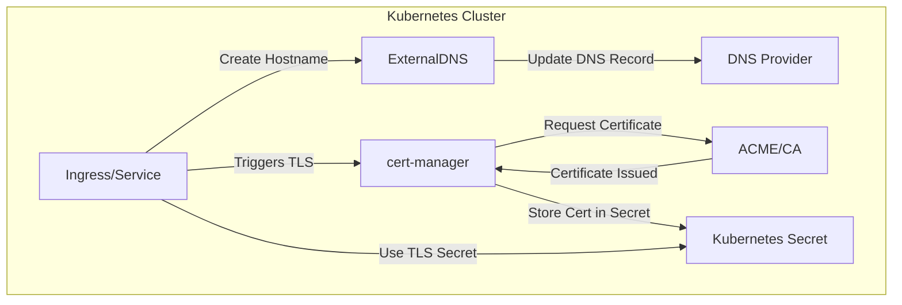
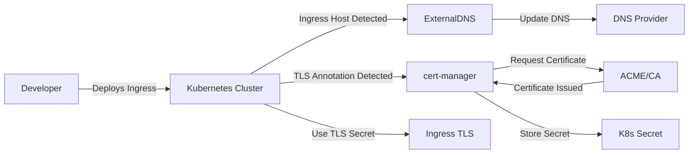

# ExternalDNS + cert-manager Integration

## Overview

This project demonstrates the integration of **ExternalDNS** and **cert-manager** in a Kubernetes cluster to manage **DNS records dynamically** and **automate TLS certificate issuance**.

* **ExternalDNS**: Automatically manages DNS records (A, CNAME, TXT) in supported DNS providers (Route53, Cloudflare, Google Cloud DNS, etc.) based on Kubernetes resources like Ingress or Services.
* **cert-manager**: Automatically provisions and renews TLS certificates for Kubernetes Ingress or Services using ACME (Let's Encrypt) or other certificate issuers.

This integration ensures that:

1. When a new Ingress is created, ExternalDNS updates your DNS provider with the hostname.
2. cert-manager requests a TLS certificate for that hostname.
3. Certificates are automatically renewed before expiration.

---

## Architecture



**Explanation:**

1. Developer creates a new Ingress with host `example.com`.
2. **ExternalDNS** monitors Ingress and creates the corresponding DNS record in the provider.
3. **cert-manager** monitors the Ingress and requests a certificate for `example.com`.
4. ACME provider issues the certificate, stored in a Kubernetes Secret.
5. The Ingress uses the Secret to serve traffic over HTTPS.

---

## Prerequisites

* Kubernetes cluster (v1.20+ recommended)
* Helm 3+ installed
* Access to a supported DNS provider
* kubectl configured to your cluster

---

## Installation Steps

### 1. Install ExternalDNS

```bash
helm repo add bitnami https://charts.bitnami.com/bitnami
helm repo update

helm install external-dns bitnami/external-dns \
  --namespace kube-system \
  --create-namespace \
  --set provider=aws \
  --set aws.zoneType=public \
  --set txtOwnerId=my-cluster \
  --set policy=sync
```

**Parameters:**

* `provider`: DNS provider (aws, google, cloudflare, etc.)
* `aws.zoneType`: Type of Route53 hosted zone
* `txtOwnerId`: Identifier for DNS ownership
* `policy`: `sync` ensures ExternalDNS syncs desired state

---

### 2. Install cert-manager

```bash
kubectl apply -f https://github.com/cert-manager/cert-manager/releases/download/v1.14.0/cert-manager.yaml
```

**Verify installation:**

```bash
kubectl get pods --namespace cert-manager
```

---

### 3. Configure Issuer / ClusterIssuer

Example using Let’s Encrypt:

```yaml
apiVersion: cert-manager.io/v1
kind: ClusterIssuer
metadata:
  name: letsencrypt-prod
spec:
  acme:
    email: your-email@example.com
    server: https://acme-v02.api.letsencrypt.org/directory
    privateKeySecretRef:
      name: letsencrypt-prod-key
    solvers:
      - dns01:
          cloudflare:
            email: CLOUDFLARE_EMAIL
            apiTokenSecretRef:
              name: cloudflare-api-token-secret
              key: api-token
```

---

### 4. Create Ingress with TLS

```yaml
apiVersion: networking.k8s.io/v1
kind: Ingress
metadata:
  name: my-app-ingress
  namespace: default
  annotations:
    cert-manager.io/cluster-issuer: "letsencrypt-prod"
spec:
  rules:
    - host: example.com
      http:
        paths:
          - path: /
            pathType: Prefix
            backend:
              service:
                name: my-app
                port:
                  number: 80
  tls:
    - hosts:
        - example.com
      secretName: my-app-tls
```

**Outcome:**

* ExternalDNS creates `example.com` DNS record.
* cert-manager requests TLS certificate for `example.com`.
* Certificate is stored in `my-app-tls` secret.
* Ingress serves HTTPS traffic automatically.

---

## Flow Diagram



---


---


