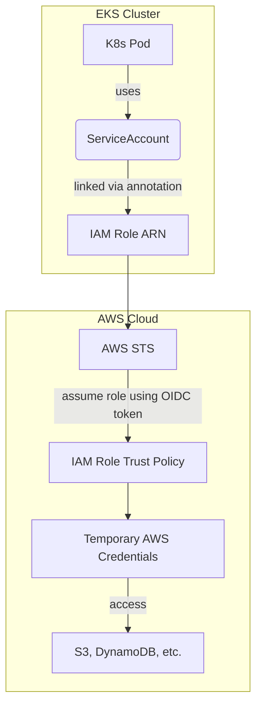

# 🧩 IRSA & IAM Roles for Kubernetes on AWS

### 🔐 **Overview**

**IRSA (IAM Roles for Service Accounts)** allows your **Kubernetes Pods** running on **Amazon EKS** to securely access AWS services **without using long-lived IAM credentials** (like access keys).
Instead, the Pod’s **ServiceAccount** is associated with an **IAM Role**, and AWS STS automatically issues **temporary credentials**.

This mechanism replaces the old pattern of mounting secrets or attaching IAM Roles to EC2 nodes.

---

## 🧭 **Concept Flow Diagram**



---

## ⚙️ **Step-by-Step Setup**

### 1. **Pre-requisites**

* AWS CLI configured (`aws configure`)
* `kubectl` installed and connected to EKS
* `eksctl` installed (optional but simplifies setup)
* OIDC Provider enabled for your cluster

```bash
eksctl utils associate-iam-oidc-provider \
    --region <region> \
    --cluster <cluster-name> \
    --approve
```

---

### 2. **Create an IAM Policy**

Define an IAM policy granting required AWS permissions (e.g., S3 access):

```bash
cat > s3-policy.json <<EOF
{
  "Version": "2012-10-17",
  "Statement": [
    {
      "Effect": "Allow",
      "Action": ["s3:ListBucket", "s3:GetObject"],
      "Resource": ["arn:aws:s3:::my-demo-bucket", "arn:aws:s3:::my-demo-bucket/*"]
    }
  ]
}
EOF

aws iam create-policy \
  --policy-name eks-s3-readonly-policy \
  --policy-document file://s3-policy.json
```

---

### 3. **Create an IAM Role for Service Account**

Using `eksctl`:

```bash
eksctl create iamserviceaccount \
  --name s3-reader \
  --namespace default \
  --cluster <cluster-name> \
  --attach-policy-arn arn:aws:iam::<account-id>:policy/eks-s3-readonly-policy \
  --approve \
  --override-existing-serviceaccounts
```

Or manually via AWS CLI:

* Create a trust policy file (`trust.json`):

```bash
cat > trust.json <<EOF
{
  "Version": "2012-10-17",
  "Statement": [
    {
      "Effect": "Allow",
      "Principal": {
        "Federated": "arn:aws:iam::<account-id>:oidc-provider/oidc.eks.<region>.amazonaws.com/id/<oidc-id>"
      },
      "Action": "sts:AssumeRoleWithWebIdentity",
      "Condition": {
        "StringEquals": {
          "oidc.eks.<region>.amazonaws.com/id/<oidc-id>:sub": "system:serviceaccount:default:s3-reader"
        }
      }
    }
  ]
}
EOF
```

* Create the IAM Role:

```bash
aws iam create-role \
  --role-name eks-s3-reader-role \
  --assume-role-policy-document file://trust.json
```

* Attach the policy:

```bash
aws iam attach-role-policy \
  --role-name eks-s3-reader-role \
  --policy-arn arn:aws:iam::<account-id>:policy/eks-s3-readonly-policy
```

---

### 4. **Create Service Account in Kubernetes**

```yaml
apiVersion: v1
kind: ServiceAccount
metadata:
  name: s3-reader
  namespace: default
  annotations:
    eks.amazonaws.com/role-arn: arn:aws:iam::<account-id>:role/eks-s3-reader-role
```

Apply it:

```bash
kubectl apply -f serviceaccount.yaml
```

---

### 5. **Deploy a Pod using the Service Account**

```yaml
apiVersion: v1
kind: Pod
metadata:
  name: s3-test-pod
spec:
  serviceAccountName: s3-reader
  containers:
    - name: aws-cli
      image: amazon/aws-cli
      command: ["sh", "-c"]
      args:
        - aws s3 ls s3://my-demo-bucket
```

Deploy it:

```bash
kubectl apply -f s3-test-pod.yaml
```

Check logs:

```bash
kubectl logs s3-test-pod
```

✅ You should see the list of objects from the S3 bucket.

---

## 🧠 **Key Learnings**

| Concept                         | Description                                                             |
| ------------------------------- | ----------------------------------------------------------------------- |
| **IRSA**                        | Lets pods assume IAM roles without access keys, using OIDC federation.  |
| **OIDC Provider**               | Acts as a trust bridge between AWS IAM and Kubernetes Service Accounts. |
| **ServiceAccount Annotation**   | The key mechanism connecting K8s to IAM Role.                           |
| **Temporary Credentials**       | Automatically managed by AWS STS, secure & short-lived.                 |
| **Fine-Grained Access Control** | You can restrict IAM permissions per Pod or namespace.                  |

---

## 📚 **Best Practices**

* Use **least-privilege IAM policies**.
* Always **enable OIDC provider** before creating roles.
* **Don’t reuse ServiceAccounts** across apps with different access needs.
* Use **namespace isolation** for multi-tenant EKS setups.
* **Monitor IAM role usage** with AWS CloudTrail.

---

## 🧩 **Useful References**

* [AWS Docs – IRSA Overview](https://docs.aws.amazon.com/eks/latest/userguide/iam-roles-for-service-accounts.html)
* [AWS Blog – Fine-grained IAM roles for pods](https://aws.amazon.com/blogs/containers/introducing-fine-grained-iam-roles-service-accounts/)
* [eksctl Docs](https://eksctl.io/usage/iamserviceaccounts/)
* [Kubernetes ServiceAccounts](https://kubernetes.io/docs/tasks/configure-pod-container/configure-service-account/)

---

## 🏁 **Summary**

By implementing **IRSA**, you achieve:

* 🚫 No static credentials in pods
* 🔐 Secure OIDC-based authentication
* ⚙️ Granular permission control
* ☁️ Native AWS service integration with Kubernetes

---

