# 🌀 GitOps with ArgoCD — Basics

## 📘 Overview

**GitOps** is a modern approach to Continuous Deployment (CD) for cloud-native applications.
It uses **Git as the single source of truth** for your declarative infrastructure and applications.

**ArgoCD** is a powerful **GitOps operator** for **Kubernetes** that continuously monitors your Git repository and synchronizes the state of your cluster with what’s defined in Git.

---

## 🚀 Key Concepts

| Concept                | Description                                                                               |
| ---------------------- | ----------------------------------------------------------------------------------------- |
| **GitOps**             | Managing infrastructure and applications through Git repositories.                        |
| **Declarative Config** | All Kubernetes manifests are stored in Git (YAML files).                                  |
| **ArgoCD**             | A Kubernetes controller that applies and syncs the desired state from Git to the cluster. |
| **Sync**               | ArgoCD ensures the live state in the cluster matches the desired state in Git.            |
| **Application CRD**    | ArgoCD custom resource defining what to deploy, from where, and to which namespace.       |

---

## 🧩 Architecture Diagram

```mermaid
flowchart LR
    subgraph GIT["🗂️ Git Repository"]
      A["app-deployment.yaml"] --> B["service.yaml"]
    end

    subgraph ARGOCD["🌀 ArgoCD (Controller in K8s)"]
      D["Repo Server"] --> E["Application Controller"]
      E --> F["API Server / UI"]
    end

    subgraph CLUSTER["☸️ Kubernetes Cluster"]
      G["Pods / Deployments"]
      H["Services / Ingress"]
    end

    GIT -->|1️⃣ Watches Repo| ARGOCD
    ARGOCD -->|2️⃣ Sync Desired State| CLUSTER
    CLUSTER -->|3️⃣ Status / Health| ARGOCD
    ARGOCD -->|4️⃣ Reports| GIT
```



---

## ⚙️ Flow of GitOps with ArgoCD

```mermaid
sequenceDiagram
    participant Dev as 👨‍💻 Developer
    participant Git as 🗂️ Git Repository
    participant ArgoCD as 🌀 ArgoCD
    participant K8s as ☸️ Kubernetes Cluster

    Dev->>Git: Commit and push app manifests
    ArgoCD->>Git: Polls for changes (via webhook or interval)
    ArgoCD->>K8s: Applies new manifests
    K8s->>ArgoCD: Reports status and health
    ArgoCD->>Dev: UI shows “Synced” / “OutOfSync”
```



---

## 🏗️ Setup Instructions

### 1. Install ArgoCD

```bash
kubectl create namespace argocd
kubectl apply -n argocd -f https://raw.githubusercontent.com/argoproj/argo-cd/stable/manifests/install.yaml
```

Check pods:

```bash
kubectl get pods -n argocd
```

### 2. Access ArgoCD UI

```bash
kubectl port-forward svc/argocd-server -n argocd 8080:443
```

Then open:
👉 [https://localhost:8080](https://localhost:8080)

Get initial admin password:

```bash
kubectl -n argocd get secret argocd-initial-admin-secret \
  -o jsonpath="{.data.password}" | base64 -d
```

---

## 🧾 Define an ArgoCD Application

Create a file: **`app.yaml`**

```yaml
apiVersion: argoproj.io/v1alpha1
kind: Application
metadata:
  name: my-nginx
  namespace: argocd
spec:
  project: default
  source:
    repoURL: 'https://github.com/your-user/your-repo.git'
    targetRevision: main
    path: k8s/nginx
  destination:
    server: 'https://kubernetes.default.svc'
    namespace: default
  syncPolicy:
    automated:
      prune: true
      selfHeal: true
```

Apply the Application:

```bash
kubectl apply -f app.yaml
```

---

## 🔁 Syncing Flow

| Step | Action                | Description                             |
| ---- | --------------------- | --------------------------------------- |
| 1    | Developer pushes code | Git repo gets updated manifests         |
| 2    | ArgoCD detects change | Watches Git for new commits             |
| 3    | ArgoCD syncs state    | Applies manifests to Kubernetes         |
| 4    | Cluster updates       | Deployments, Services, etc. are updated |
| 5    | ArgoCD updates status | UI and CLI show synced state            |

---

## 🧠 Tips

* Use **webhooks** for instant syncs instead of polling.
* Organize YAML files by environment (`dev/`, `staging/`, `prod/`).
* Use **ApplicationSets** for multi-environment automation.
* Enable **RBAC and SSO** for production-grade setups.

---

## 🔍 Example Repository Structure

```
gitops-repo/
├── README.md
├── k8s/
│   ├── nginx/
│   │   ├── deployment.yaml
│   │   ├── service.yaml
│   └── redis/
│       ├── deployment.yaml
│       ├── service.yaml
└── app.yaml
```

---

## 🧭 CLI Commands

| Command                        | Description           |
| ------------------------------ | --------------------- |
| `argocd login <ARGOCD_SERVER>` | Login to ArgoCD       |
| `argocd app list`              | List all applications |
| `argocd app sync my-nginx`     | Manually sync app     |
| `argocd app delete my-nginx`   | Delete application    |
| `argocd app history my-nginx`  | View sync history     |

---

## 📊 ArgoCD Sync States

| State         | Meaning                                |
| ------------- | -------------------------------------- |
| **Synced**    | Cluster state matches Git              |
| **OutOfSync** | Git has changes not applied to cluster |
| **Healthy**   | All resources running fine             |
| **Degraded**  | Some resources failing or crashlooping |

---

## 🧩 Example Visualization — GitOps Lifecycle


## 

* **Git is your source of truth** for deployments.
* **ArgoCD** ensures cluster state always matches Git.
* Changes are **auditable**, **reproducible**, and **safe**.
* Perfect for **multi-environment**, **multi-team**, and **secure CI/CD** pipelines.


