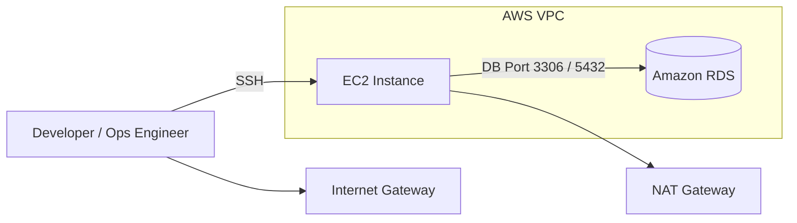
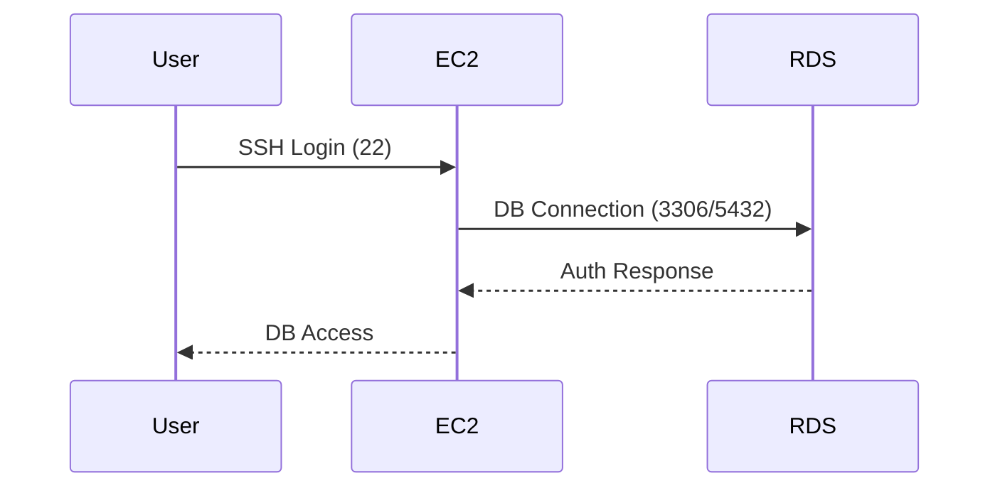

# Setup Amazon RDS and Connect from EC2 (End-to-End Guide)

This document provides a **deep, step-by-step guide** to set up **Amazon RDS** and securely connect to it from an **EC2 instance**, including **networking, security, IAM, and troubleshooting**.

---

## 1. High-Level Architecture



### Flow Explanation

1. User connects to **EC2 via SSH**.
2. EC2 resides inside a **VPC subnet**.
3. EC2 communicates with **RDS** over a **private network**.
4. Security Groups control **who can talk to whom**.

---

## 2. Prerequisites

* AWS Account
* IAM User with permissions for:

  * EC2
  * RDS
  * VPC
* Key Pair for EC2
* Basic Linux and SQL knowledge

---

## 3. Create a VPC (Recommended)

> You may use the **default VPC**, but a **custom VPC** is best practice.

### VPC Components

* **CIDR**: `10.0.0.0/16`
* **Public Subnet** (EC2): `10.0.1.0/24`
* **Private Subnet** (RDS): `10.0.2.0/24`
* Internet Gateway
* Route Tables

---

## 4. Create Security Groups

### 4.1 EC2 Security Group (SG-EC2)

| Rule Type | Protocol | Port | Source    |
| --------- | -------- | ---- | --------- |
| SSH       | TCP      | 22   | Your IP   |
| Outbound  | All      | All  | 0.0.0.0/0 |

### 4.2 RDS Security Group (SG-RDS)

| Rule Type          | Protocol | Port        | Source |
| ------------------ | -------- | ----------- | ------ |
| MySQL / PostgreSQL | TCP      | 3306 / 5432 | SG-EC2 |

🔒 **Important:** RDS should NOT allow `0.0.0.0/0`.

---

## 5. Launch EC2 Instance

### Configuration

* AMI: Amazon Linux 2 / Amazon Linux 2023
* Instance Type: `t3.micro` (Free Tier)
* Subnet: Public Subnet
* Auto-assign Public IP: Enabled
* Security Group: `SG-EC2`
* Key Pair: Your existing key

### Connect to EC2

```bash
ssh -i my-key.pem ec2-user@<EC2_PUBLIC_IP>
```

---

## 6. Create Amazon RDS

### Database Settings

| Setting        | Value              |
| -------------- | ------------------ |
| Engine         | MySQL / PostgreSQL |
| Version        | Latest stable      |
| Instance Class | db.t3.micro        |
| Storage        | 20 GB              |
| Multi-AZ       | No (for dev)       |
| Public Access  | ❌ No               |
| Subnet Group   | Private Subnet     |
| Security Group | SG-RDS             |

### Credentials

* Master Username
* Master Password

⚠️ Save credentials securely.

---

## 7. Install DB Client on EC2

### For MySQL

```bash
sudo yum update -y
sudo yum install mysql -y
```

### For PostgreSQL

```bash
sudo yum install postgresql15 -y
```

---

## 8. Connect to RDS from EC2

### MySQL

```bash
mysql -h <RDS_ENDPOINT> -u admin -p
```

### PostgreSQL

```bash
psql -h <RDS_ENDPOINT> -U admin -d postgres
```

If connected successfully → networking and security are correct ✅

---

## 9. Connection Flow (Detailed)



---

## 10. IAM Role (Optional but Recommended)

Attach an IAM role to EC2 for:

* Secrets Manager access
* CloudWatch Logs

Example Policy:

* `AmazonRDSReadOnlyAccess`
* `SecretsManagerReadWrite`

---

## 11. Best Practices

* Keep RDS **private**
* Use **Secrets Manager** instead of hardcoding passwords
* Enable **automated backups**
* Use **parameter groups** for tuning
* Restrict SSH access by IP

---

## 12. Common Issues & Fixes

### ❌ Can't connect to RDS

* Check RDS Security Group inbound rule
* Ensure EC2 SG is allowed
* Verify port number

### ❌ Timeout

* EC2 and RDS must be in **same VPC**
* Check route tables

### ❌ Authentication failed

* Reset RDS master password

---

## 13. Production Enhancements

* Multi-AZ RDS
* Read Replicas
* Bastion Host
* SSL/TLS DB connections
* CloudWatch Alarms

---

## 14. Summary

✔ Secure VPC setup
✔ EC2 in public subnet
✔ RDS in private subnet
✔ SG-to-SG communication
✔ No public DB exposure

This setup follows **AWS Well-Architected Framework** principles.

---

### Author

Prepared for DevOps / Backend Engineers
