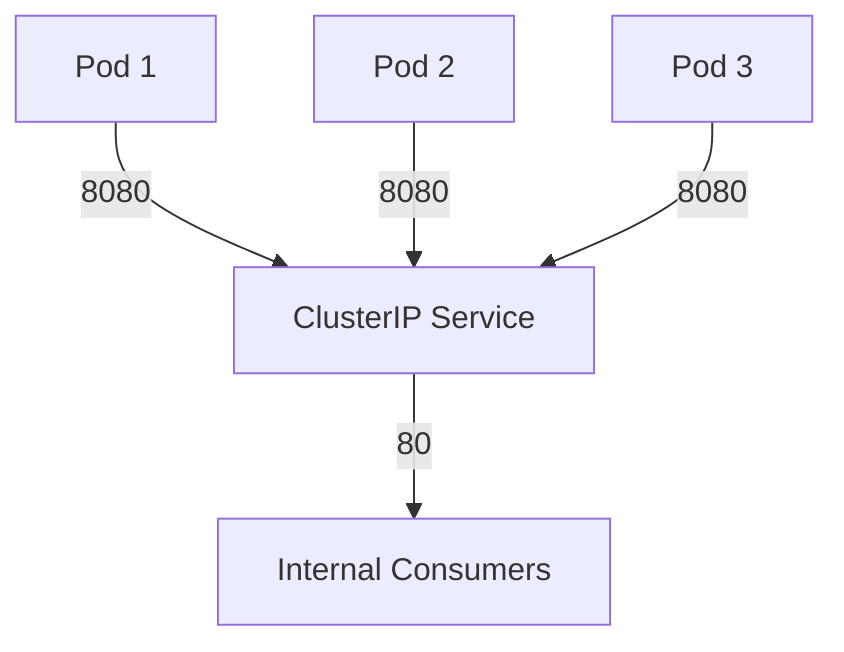
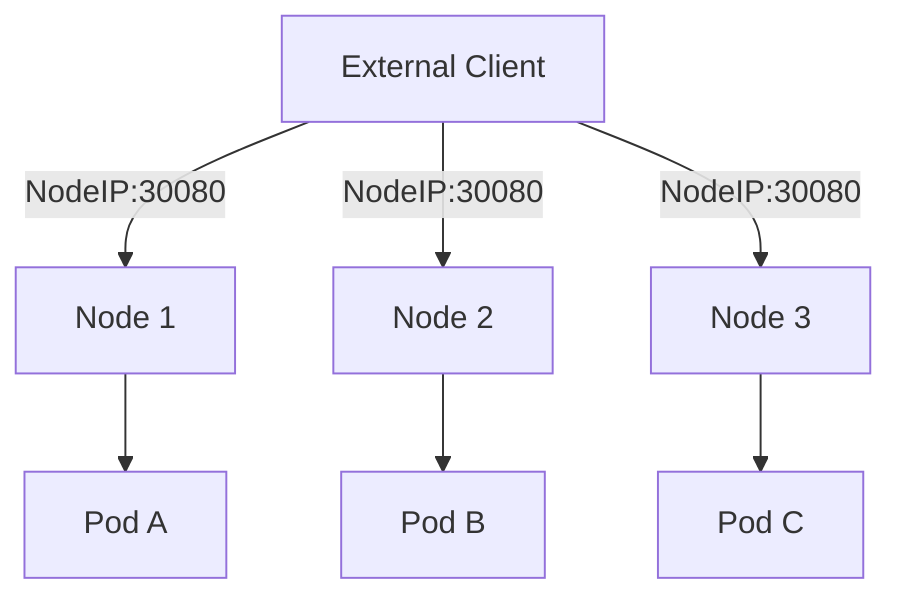
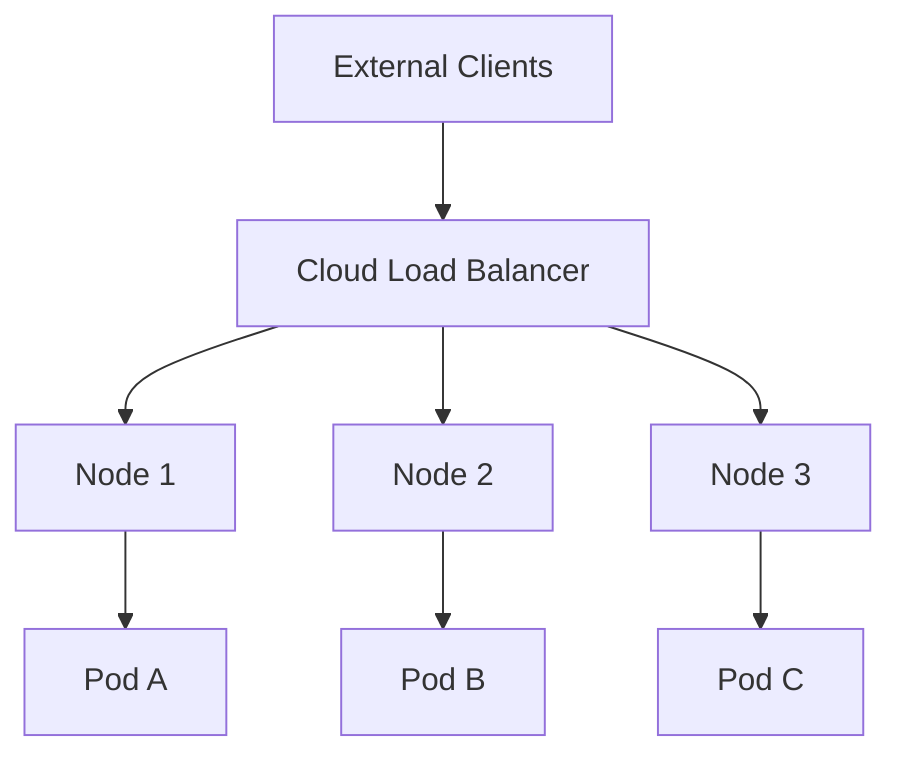
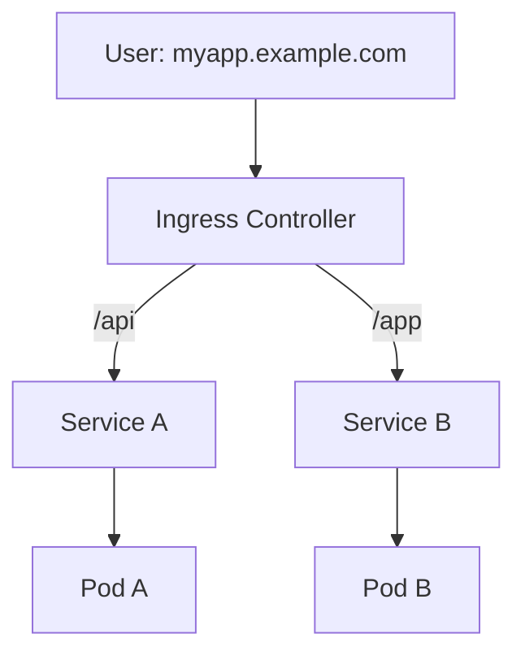
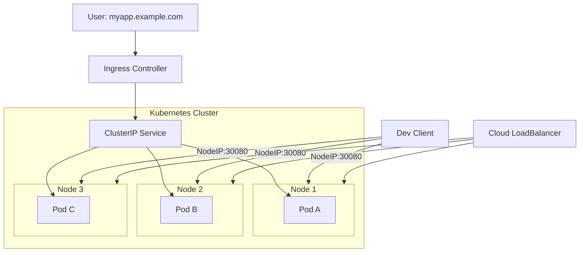

# ☸️ Kubernetes Services – ClusterIP, NodePort, LoadBalancer, Ingress

## 🔹 Introduction

In Kubernetes, a **Service** is an abstraction that defines a logical set of Pods and a stable way to access them.
Since Pods are ephemeral and IPs change, Services provide consistent networking.

There are four main ways to expose applications:

1. **ClusterIP** – Internal access only (default).
2. **NodePort** – Exposes a port on each node.
3. **LoadBalancer** – Uses a cloud provider load balancer.
4. **Ingress** – Smart HTTP/HTTPS routing with domains & TLS.

---

## 🔹 1. ClusterIP (Default)

* Exposes service **only inside** the cluster.
* Used for **Pod-to-Pod** or **Pod-to-Service** communication.
* Default type if not specified.

```yaml
apiVersion: v1
kind: Service
metadata:
  name: my-service
spec:
  type: ClusterIP
  selector:
    app: my-app
  ports:
    - port: 80
      targetPort: 8080
```

### Diagram



---

## 🔹 2. NodePort

* Opens a port **(30000–32767)** on each node.
* Access via `<NodeIP>:<NodePort>`.
* Good for testing; not ideal for production.

```yaml
apiVersion: v1
kind: Service
metadata:
  name: my-service
spec:
  type: NodePort
  selector:
    app: my-app
  ports:
    - port: 80
      targetPort: 8080
      nodePort: 30080
```

### Diagram



---

## 🔹 3. LoadBalancer

* Integrates with **cloud providers** (AWS ELB, Azure LB, GCP LB, etc.).
* Automatically provisions an external load balancer with a **public IP**.
* Best for production single-service apps.

```yaml
apiVersion: v1
kind: Service
metadata:
  name: my-service
spec:
  type: LoadBalancer
  selector:
    app: my-app
  ports:
    - port: 80
      targetPort: 8080
```

### Diagram



---

## 🔹 4. Ingress

* **Not a Service**, but works alongside them.
* Provides **L7 routing (HTTP/HTTPS)**:

  * Path-based (`/api` → backend1, `/app` → backend2).
  * Host-based (`api.example.com` → backend1).
* Supports **TLS/HTTPS** termination.
* Requires an **Ingress Controller** (NGINX, Traefik, HAProxy, etc.).

```yaml
apiVersion: networking.k8s.io/v1
kind: Ingress
metadata:
  name: my-ingress
spec:
  rules:
  - host: myapp.example.com
    http:
      paths:
      - path: /
        pathType: Prefix
        backend:
          service:
            name: my-service
            port:
              number: 80
```

### Diagram



---

## 🔹 Combined Diagram – All Service Types



---

## 🔹 Summary

| Type             | Scope          | Accessible From      | Use Case                         |
| ---------------- | -------------- | -------------------- | -------------------------------- |
| **ClusterIP**    | Internal only  | Inside cluster       | Pod-to-Pod communication         |
| **NodePort**     | Node IP + Port | External (manual)    | Dev/testing                      |
| **LoadBalancer** | Cloud Provider | External (public IP) | Production, simple apps          |
| **Ingress**      | L7 HTTP/HTTPS  | External (Domain)    | Routing, TLS, multi-service apps |

---

## 🔹 References

* [Kubernetes Services](https://kubernetes.io/docs/concepts/services-networking/service/)
* [Ingress Overview](https://kubernetes.io/docs/concepts/services-networking/ingress/)
* [Ingress Controllers](https://kubernetes.io/docs/concepts/services-networking/ingress-controllers/)

---

✨ **In short:**

* **ClusterIP** → internal only.
* **NodePort** → basic external access.
* **LoadBalancer** → external access with cloud LB.
* **Ingress** → smart HTTP/HTTPS routing with TLS & domains.

---

