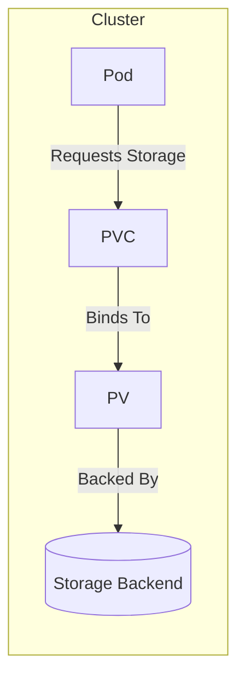
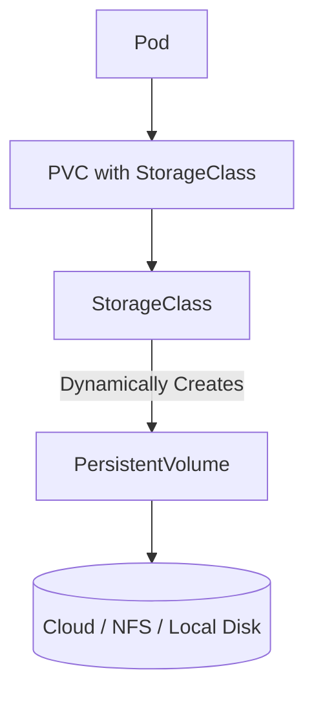

# 📦 Kubernetes Storage: PV, PVC & StorageClass

Kubernetes provides powerful abstractions to manage persistent data for stateful applications. Instead of tying pods directly to a disk, Kubernetes introduces **PersistentVolumes (PV)**, **PersistentVolumeClaims (PVC)**, and **StorageClasses**.

This ensures your apps can store data **independently of pod lifecycle** and across **different storage backends**.

---

## 🔹 1. PersistentVolume (PV)

* A **cluster-level resource** representing actual physical storage.
* Can be backed by:

  * Local storage (`hostPath`)
  * Network storage (NFS, Ceph, GlusterFS)
  * Cloud storage (AWS EBS, GCP PersistentDisk, Azure Disk)
* Created by **admins** (or dynamically by StorageClass).

---

## 🔹 2. PersistentVolumeClaim (PVC)

* A **request for storage** by a user/pod.
* Similar to how pods request CPU/RAM.
* PVCs are **matched and bound** to suitable PVs.

Example:

* PVC requests `5Gi` storage, `ReadWriteOnce` mode.
* Kubernetes finds a PV that satisfies it (≥5Gi and same access mode).

---

## 🔹 3. StorageClass

* Defines **provisioning rules** for storage.
* Enables **Dynamic Provisioning** → Kubernetes creates PVs **on-demand**.
* Each StorageClass has:

  * Provisioner (e.g., `kubernetes.io/aws-ebs`)
  * Parameters (e.g., volume type, replication)
  * ReclaimPolicy (`Delete` or `Retain`)

---

## 🖼️ Diagrams

### PV-PVC Binding (Static Provisioning)



### StorageClass Dynamic Provisioning



---

## 📄 Example Manifests

### 1. StorageClass (AWS EBS)

```yaml
apiVersion: storage.k8s.io/v1
kind: StorageClass
metadata:
  name: fast-ssd
provisioner: kubernetes.io/aws-ebs
parameters:
  type: gp3
  fsType: ext4
reclaimPolicy: Delete
volumeBindingMode: WaitForFirstConsumer
```

### 2. PersistentVolumeClaim (PVC)

```yaml
apiVersion: v1
kind: PersistentVolumeClaim
metadata:
  name: my-app-pvc
spec:
  accessModes:
    - ReadWriteOnce
  resources:
    requests:
      storage: 10Gi
  storageClassName: fast-ssd
```

### 3. Pod Using PVC

```yaml
apiVersion: v1
kind: Pod
metadata:
  name: app-using-pvc
spec:
  containers:
  - name: app
    image: nginx
    volumeMounts:
      - mountPath: "/usr/share/nginx/html"
        name: storage
  volumes:
  - name: storage
    persistentVolumeClaim:
      claimName: my-app-pvc
```

---

## 🌍 Real-World Examples

### ✅ Example 1: AWS EBS (Cloud Storage)

1. Define a **StorageClass** for AWS EBS.
2. Create a **PVC** requesting storage.
3. When pod starts, Kubernetes provisions an EBS volume dynamically.

```yaml
apiVersion: storage.k8s.io/v1
kind: StorageClass
metadata:
  name: aws-standard
provisioner: ebs.csi.aws.com
parameters:
  type: gp3
  fsType: xfs
reclaimPolicy: Delete
```

### ✅ Example 2: NFS (Network Storage)

For shared storage across multiple pods (ReadWriteMany):

**PersistentVolume (static)**

```yaml
apiVersion: v1
kind: PersistentVolume
metadata:
  name: nfs-pv
spec:
  capacity:
    storage: 20Gi
  accessModes:
    - ReadWriteMany
  nfs:
    path: /mnt/shared
    server: 192.168.1.100
  persistentVolumeReclaimPolicy: Retain
```

**PVC**

```yaml
apiVersion: v1
kind: PersistentVolumeClaim
metadata:
  name: nfs-pvc
spec:
  accessModes:
    - ReadWriteMany
  resources:
    requests:
      storage: 10Gi
```

**Deployment using PVC**

```yaml
apiVersion: apps/v1
kind: Deployment
metadata:
  name: web-deployment
spec:
  replicas: 2
  selector:
    matchLabels:
      app: web
  template:
    metadata:
      labels:
        app: web
    spec:
      containers:
      - name: web
        image: httpd
        volumeMounts:
        - name: web-storage
          mountPath: /usr/local/apache2/htdocs/
      volumes:
      - name: web-storage
        persistentVolumeClaim:
          claimName: nfs-pvc
```

---

## 🔗 References

* [Kubernetes Docs: Persistent Volumes](https://kubernetes.io/docs/concepts/storage/persistent-volumes/)
* [Kubernetes Docs: Storage Classes](https://kubernetes.io/docs/concepts/storage/storage-classes/)
* [Kubernetes Docs: Dynamic Provisioning](https://kubernetes.io/docs/concepts/storage/dynamic-provisioning/)
* [AWS EBS CSI Driver](https://github.com/kubernetes-sigs/aws-ebs-csi-driver)
* [NFS Persistent Volumes](https://kubernetes.io/docs/concepts/storage/volumes/#nfs)

---

## 🚀 Summary

* **PV** = Actual storage resource.
* **PVC** = Request for storage.
* **StorageClass** = Rules for dynamic provisioning.

